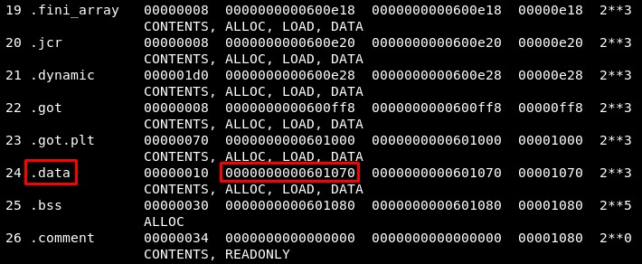

# bacdchars

Link: https://ropemporium.com/challenge/badchars.html

--------------------------

First we check if the offset is different than in the previous challenge, "ret2win". It seems it is still 40, with 42 characters we see two "41" in RIP registry:


Then we must find the hexadecimal values of the bad characters the binary tells us that exist in it:

- b - 62
- i - 69
- c - 63
- / - 2f
- <space> - 20
- f - 66
- n - 6e
- s - 73


**bad_chars = ["62", "69", "63", "2f", "20", "66", "6e", "73"]**

Then we find a write-what-where address:


We have:

- 0x0000000000400b35 : mov dword ptr [rbp], esp ; ret

- 0x0000000000400b34 : mov qword ptr [r13], r12 ; ret

We can control R12 and R13 with:

- 0x0000000000400b3b : pop r12 ; pop r13 ; ret

- 0x0000000000400b3d : pop r13 ; ret


Then we will look for the start address of .data, which is writable:



We will use R12 and R13 to write "/bin/sh" in memory, so:

- **writewhatwhere = 0x400b34**

- **pop_r12_r13_ret = 0x400b3b**

- **writable_memory = 0x601080** (0x601050 was giving problems)

```
mov [r13], r12

mov [0x601050], "/bin//sh"
```