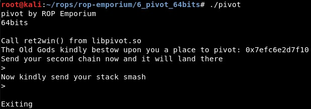
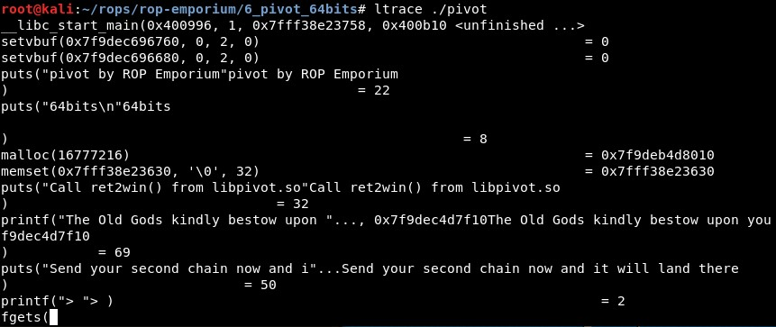
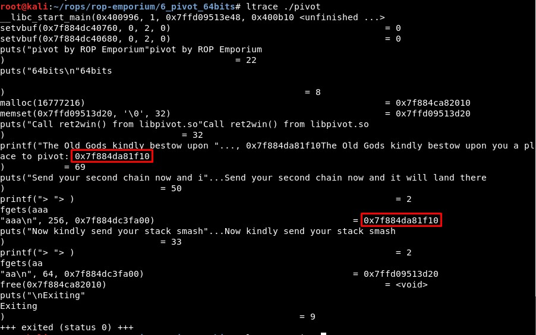
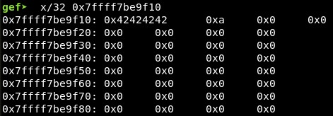

# pivot

From [here](), we know that *a stack pivot involves modifying the value of the RSP register to point to somewhere else in memory under your control. Modifying the stack pointer will cause the program to believe that wherever RSP is pointing to is now the new stack, and it’ll continue executing whatever’s next in memory in that new location. This means that if there’s somewhere else in memory that offers plenty of space for a ROP chain, you can use your limited space to employ gadgets that will modify the RSP register and cause it to point to the rest of your ROP chain, which will then be executed.*

*The most obvious method of achieving a stack pivot is to use your constrained space for a gadget like pop RSP; ret, which offers easy control of the stack pointer.*

We will also read these blogs:

- http://neilscomputerblog.blogspot.com/2012/06/stack-pivoting.html#:~:text=Stack%20Pivoting,%22%20using%20attacker%2Dspecified%20values.&text=Semantically%20this%20means%20that%20ESP,is%20the%20instruction%20pointer%20register

- https://ctf-wiki.github.io/ctf-wiki/pwn/linux/stackoverflow/fancy-rop/

We will use ROPgadget to find a convenient gadget:

```
python /root/tools/ROPgadget/ROPgadget.py --binary pivot | grep "pop rsp"
```
We find only line:

- 0x0000000000400b6d : pop rsp ; pop r13 ; pop r14 ; pop r15 ; ret

The binary tells us an address to pivot, and then asks for the "second chain" and the "stack smash":



We will parse the output until the character ">" to get the address to jump to:

``` 
received = p.recvuntil("> ")
pivot_address = received.split("pivot: ")[1].split("\n")[0]
log.info("Pivoting to address "+pivot_address)
```

The file is dynamically linked and it uses the ".so" file:


Addresses in libpivot.so:

- 0000000000000abe <ret2win>:
- 0000000000000970 <foothold_function>:


Addresses in pivot:

-   400850:	ff 25 f2 17 20 00    	jmpq   0x2017f2(%rip)        # 602048 <foothold_function>


So address in .plt is 0x400850 and in .plt.got in 0x602048.


It uses fgets:




The offset is 40 in the case of the second input:


So the stack pivot should be sent in the second input, and it will jump to execute what we send in the first input. We can check this executing the program with "ltrace" again:




We can check this also using gdb by sending "BBBB" (0x62626262) in the first input and 41 "A" characters in the second input, and then listing the content in the address where the program tells us to jump:   



With vmmap we can see this address (in this case, 0x7ffff7be9f10) is located between the heap and the sections of libc-2.29.so (I am not sure why, maybe because then we know it will be all zeros and that section is also writable).


